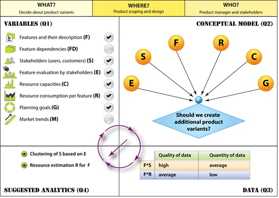

#  What Counts is Decisions, Not Numbers – Towards an Analytics Design Sheet
*Guenther Ruhe and Maleknaz Nayebi, Laboratory for Software Engineering Decision Support, University of Calgary, AB, Canada*

## 1. Decisions everywhere
Just about 20% of the features implemented in a software product are often or always used, while 64% of the features get rarely or never used [6]. This means that substantial development effort is wasted. But even worse: it means that maintenance cost of the product (constituting the majority of the total product effort) is higher than needed. This often implies delays in delivering products or lack of quality. While this deficit in qualified decision-making is of obvious impact on business success, this chapter looks into a systematic and template-based approach to guide selecting the right analytics for supporting key decisions to be made. 

Product release decisions (What features to release next? When to release them? Focus on functionality versus quality of features?) are just one example of the wide spectrum of decisions that have to be made by project and product managers, architects or developers. Some of these decisions are related to operational questions (who should fix this bug?), others are more strategic decisions in their nature (outsourcing which parts of development? Migration to another platform?). In all these cases, we want to select best alternatives based on some evaluation criteria. The alternatives need to be feasible in term of some hard constrains on cost, time, quality or technical conditions that need to be fulfilled. Depending on the problem, the number of alternatives might be small (just yes or no for the migration example), or large (if we consider possible product roadmaps over a period of releases). 

At the end, all these decisions are made by humans. However, the difference is in how much the human decision makers can rely on insight gained from analytics, and how much of it is just based on subjective beliefs. Performing (different types of) analytics is an important piece in the more comprehensive picture of providing decision support. The idea of offering decision support always arises when decisions have to be made in complex, uncertain and/or dynamic environments. More specifically, support is directed to-wards one or more of the following: 

-	Increasing the likelihood to make a good decision (towards achieving stated goals),
-	Increasing the likelihood of avoiding to make a wrong decision,
-	Presenting qualified alternatives to facilitate human expert involvement for the final selection of the decision alternative,
-	Reducing the effort to determine a (good) decision by structuring the information and variables, and 
-	Justifying/explaining a proposed decision.

Looking into research papers in the domain of analytical project management, there is a gap in terms of importance. The most important types of analytics are the ones least studied by researchers [5]. As a conclusion, researchers are requested to look deeper in-to descriptive and diagnostic analytics, thus not only supporting managers in decision making, but also helping them to justify these decisions based on former knowledge and experience. This analysis would help practitioners to identify the events that happened in the project which forced them to change the initial plans. We provide guidance for the process of analytics which leads to decisions by offering Analytics Design Sheet. Analytics Design Sheet is intended to leverage the right analytics to make better decisions.

## 2. The decision-making process
Decision-making for software products is a process, and often is not a simple and sequential one, considering all the stakeholders and complexities involved. We look at this process from an analytics perspective and define what analytics can be provided at its different steps. 

**Step 1 Modeling and scoping:** A conceptual model is created describing the scope and context of the decision studied. This includes decision variables, independent variables and context factors to be taken into account. 

**Step 2 Information gathering:** Based on the model created, information from different source is retrieved and pre-processed, inside and outside the organizational context you are in.

**Step 3 Identify and evaluate alternatives:** As a form of synthesis, information is explored to determine possible and desirable alternatives. This is a creative process where missing some of the alternatives is risky as you might miss the best possible decision. Having too many alternative makes the final selection more difficult. Each alternative is evaluated against one or more of the (typically competing) objectives. 

**Step 4 Select one alternative:** Among the identified alternatives received from Step 3, selecting the most appropriate one, which is fulfilling hard and potential soft constraints, is needed. This selection is a human-based activity, and all analytics done in previous steps should be in support of this selection. 

**Step 5 Implement:** The selected alternative is implemented as the solution to the original problem.

**Step 6 Monitor and adjust to change:** The need to adjust to changes is the result of the inherent uncertainties in the actual decision context. Effort, cost, value or market conditions might change, and this implies that a partially implemented solution needs to be adjusted to better match with the new situation. 
While Steps 1 and 5 are not directly related to analytics, the other steps mostly benefit from analytics. Data collection and pre-processing is seen as part of data analytics, too. The strongest connection is in Step 3, where analytics helps to identify and evaluate alternatives. In the next section, we are proposing a template-based approach to guide users and practitioners to find the right level and right content of analytics and to facilitate team based problem analysis. 

## 3. The Analytics Design Sheet
There are very different types of decisions and different types of analytics. We propose the Analytics Design Sheet as a guide for designing the right analytics to be made to sup-port decision-making. The decision under consideration is described in terms of it’s What? Where? Who? Components. Similar to the abstraction sheet introduced for GQM measurement [1], the Analytics Design Sheet, shortly ADS, consists of four quadrants Q1 to Q4 devoted to 

- **Variables:** Internal factors, external factors, dependent and independent factors, (Q1).
- **Conceptual model:** Relationship between selected variables (Q2). 
- **Data:** Quantity and quality (Q3).
- **Suggested analytics:** Content and type of analytics (Q4).

The sheet summarizes key steps for selecting the right analytics and the decision to be made should act as the compass for that. In Q1 of the ADS, relevant variables are select-ed and separated from the variables being outside the scope. Q2 represented a conceptual model of the decision problem. Conceptual models provide an informal explanation of how things work. To facilitate brainstorming and discussion between different stake-holders (e.g., industry and academia), no specific syntax and semantic is prescribed at this stage. Established techniques such as causal or influence diagrams [2] can be used here. The resulting conceptual model serves as a skeleton to more formal modeling approach-es. Q3 evaluates data features and provides the status quo in terms of quantity and quality of the data for conducting analytics. Finally, Q4 provides (human expert based opinion on) alternatives for selecting the right analytics and to apply it in the right way.

## 4. An illustrative example
We illustrate the idea of the ADS by an example taken from [4]. The decision under consideration is classified in the heading of the sheet.. A product manager needs to decide about moving from one product (to be designed in terms of features for upcoming re-leases) to more than one product variants. The internal and external variables relevant and taken into account are listed under Q1. We note that “Market trends” is relevant, but not part of the actual model, maybe because of the lack of data. Same is true for “Feature dependencies”. Q2 of Figure 1 shows the key attributes taken into account for this decision and how do they relate to each other. Traversing the sheet from Q1 --> Q2--> Q3, and taking into account actual data availability, the result of this process is to propose (in Q4):

-  Clustering of stakeholders based on the commonality of their preferences against stated objectives, and 
- Effort estimation (e.g., analogy based) for implementation of features based on experience with similar features implemented in the past.
 
 
*Figure 1. Sample Analytics Design Sheet in support of the decision on creating new product variants.*

The ADS is a semi-formal approach, used by and in support of human experts. It is based on their existing knowledge and experience. The selection of specific analytical techniques is outside the scope of the sheet. With some initial evidence from applying AHS, a more comprehensive evaluation of its usefulness is outstanding. Overall, the proposed approach is intended facilitating the transition from numbers to decisions, thus making analytics more focused and oriented towards (software engineering) decision support.

## References
[1] Basili, V. R., et al. (2001). The Goal Question Metric Approach. Encyclopedia of Software Engineering, Wiley.

[2] Burgess, C. J., et al. (2001). "Using Influence Diagrams to Aid the Management of Software Change." Requirements Engineering 6(3): 173-182.

[3] Menzies, T. and Zimmermann (2013). "Software Analytics: So What?" IEEE Software 30(4): 31-37.

[4] Nayebi, M. and Ruhe, G. "Analytical Product Release Planning ", in Analyzing Software Data, Menzies, T, Bird, C, Zimmermann, T. (eds.), Morgan Kauffman 2015, pp. 550 - 580.

[5] Nayebi, M. Ruhe, G. Mota, R. and Mufti, M. “Analytics for Software Project Management - Where Are We and Where Do We Go?”, Proceedings ACTION 2015, co-located to ASE 2015

[6] Standish (2002). "What are your Requirements?" retrieved from http://www.standishgroup.com/.
