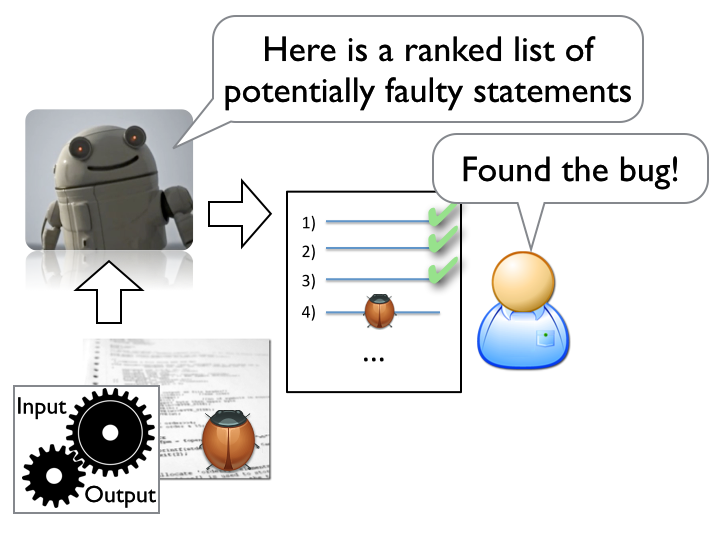

# Are We Really Helping Developers?

_Alessandro Orso_, Georgia Institute of Technology

## Premise

Although one may argue that this chapter is not exactly about software analytics, the family of techniques that are at the core of the chapter can be seen as _data anlytics for software debugging_. In particular, that are many parallels between the way techniques in the software analytics space and statistical debugging techniques operate. This paper therefore argues there the conclusions and findings for the latter can teach us a general lesson for the former.

## With Big Data Comes Great Responsibility

Spectra based (or statistical) fault localization is a family of debugging techniques that aim to identify potentially faulty code by mining both passing and failing executions of a faulty program, inferring their statistical properties, and presenting developers with a ranked list of potentially faulty statements to inspect. The first instances of these techniques (e.g., [1, 2]) were clever, disruptive, and promising. Case in point, Reference [1] was awarded an ACM SIGSOFT Outstanding Research Award, and the dissertation based on Reference [2] received an ACM Doctoral Dissertation Award. Unfortunately, however, statistical debugging became too trendy for its own good. A few years after these first groundbreaking techniques were presented, researchers started to propose all sorts of variations on the initial idea. In most cases, these variations consisted in using a different formula for the ranking and showing slightly improvements in the effectiveness of the approach. 

This is a typical example of a situation in which (1) the presence of readily available data and (2) the possibility of deriving potentially interesting conclusions from mining such data can make researchers forget their initial goal--helping developers--and the many potential issues with their analysis (e.g., bias, wrong assumptions, confounding factors, spurious correlations, noise). We argue that researchers should have instead investigated, after the approach became mature and well understood, whether and to what extent statistical fault localization could actually help developers.

## Assessing the Usefulness of a Technique

The best way to assess the practical usefulness of a technique is to put it in the hand of the developers. This is what we did for statistical fault localization, whose general process is illustrated in Figure 1. As the figure shows, given a faulty program, statistical fault localization whould produce a ranked list of  


_Figure 1: An abstract view of statistical fault localization._


debugging tools help developers.
• An analysis of the study results and a discussion of the implications of such results for future research in the area of fault localization and debugging in general.


One problem with this general class of techniques is that they focus exclusively on trying to reduce the number of statements developers need to examine when investigating a failure, under the assumption that examining a faulty state- ment in isolation is enough for a developer to detect and fix the corresponding bug. Unfortunately, it is unclear whether developers can actually determine the faulty nature of a statement by simply looking at it, without any additional information (e.g., the state of the program when the state- ment was executed or the statements that were executed before or after that one). When using these techniques, this type of information can only be gathered by rerunning the program against the input that caused the failure being in- vestigated. In general, without a clear understanding of how developers would use these techniques in practice, the po- tential effectiveness of such techniques remains unknown.

The case addressed in this paper is not so blatant, but it definitely bears similarities with this 


, stupid, or incompetent. When the Emperor parades before his subjects in his new clothes, no one dares to say that he doesn't see any suit of clothes until a child cries out, "But he isn't wearing anything at all!" The tale has been translated into over a hundred languages.[1]


I do not really work on data analytics, but I am an informed outsider.
So when I was preparing my talk I decided to make the presentation more fun and take a slightly polemic/controversial stand.
So the title is not really “Data Analytics for Debugging”, but instead…


## What not to do

Legend has it that Archimedes once solved a problem sitting in
his bathtub.
Crying  _Eureka!_ ("I have it!"), legend says he leapt out
of the bath and ran to tell the king about the solution.
Legend does not say if he stopped to get dressed first.

When we stumble onto some pattern in the data, it is
so tempting to send a _Eureka!_ text to the business
users.  This is a natural response that stems from
the excitement of doing science and discovering an
effect that no one has ever seen before.

Here's my warning: don't do it. And least, don't do it straight away.

I say this because I have often fallen into the trap
of _correlation is not causation_. Which is to say,
just because some  connection pattern has been observed between
variables does  not necessarily imply that a  real-world causal mechanism
has been discovered. In fact, that "pattern" may actually just
be an accident- a mere quirk of cosmic randomness.  

## Example

For an example of nature tricking us and offering a "pattern"
where, in fact, no such pattern exits, consider the following
two squares (this example comes from  Peter Norvig).
One of these was generated by people pretending
to be a coin toss while the others were generated by actually
tossing a coin, then writing vertical and horizontal marks
for heads or tails.

```
-||--|-|-||-|-||-||-|--|-|
--||---|--||--|-|--|-|-|--
---|-|-|--||-|-|||-|--|-||
--|-|-||--|--||-||-|-|-||-
-|-||--||-||-||-|-|--|-|||
|-||||-||-|||-|-|||-||---|
|-|-|-||--|--|---|-|--||-|
-|-|||--|-||-||-|-|-||---|
-|--||----|||-|-||-|-||-|-
||-|||-|-|-||-|--|-|-||||-
---||-|-|||--|-|-|---|-|--
|||--|--|-|-||-||-|-|-||-|
           (A)
		   
-|-|||-----|-------||--|-
-||--|||||--|--|-|||-||||
--||----||-||-|----|--|-|
||-|-|-|||-||--|||-|-||||
|-|||-|-|--||-|-|-||--|--
||-|--|-----|----|---||--
||---|---|-||||-|||||-|-|
|---|---||-||||-|-|------
-|---|-|||-|---||-||-|---
|||-||----||||||-|||||---
|-|------||----||-||-----
-|||-|||-|--|--|-||------
             (B)
```
Can you tell which one is really random? Clearly, not (B) since it has too
many runs long runs of horizontal and vertical marks.
But hang on-- is that true?
If we toss a coin 300 times, then at probability 25%, 12%, 6%, 3% we will
get a run of the same mark that is three, four,  five, or six ticks long.
Now 0.03*300=9 so in (B), we might expect several  runs that are at least
six ticks long. That is, these "patterns" of long ticks in (B) are actually
just random noise.

## Case Studies in SE

Sadly, there are many examples in software
engineering of data scientists uncovering "patterns"
which, in retrospect, was more "jumping at shadows"
than discovering some underlying causal
mechanism.  For example,  Shull et al. reported
one study at NASA's
Software Engineering Laboratory that
"discovered" a category of software that seemed
inherently most bug prone.
The problem with that
conclusion was that, while certainly true, it missed
an important factor. It turns out that that
particular sub-system was the one deemed least
critical by NASA. Hence, it was standard policy to let
newcomers work on that sub-system in order to learn
the domain.  Since such beginners make more
mistakes, then it is hardly surprising that this
particular sub-system saw most errors.

For another example, 
Kocaguneli et al. had to determine which code files were
created by a distributed or centralized development
process. This, in turn, meant mapping files to their
authors, and then situating some author in a
particular building in a particular city and
country.  After  weeks of work  they "discovered" that a very small number
of people seemed to produced most of the core
changes to certain Microsoft products. Note that if
this was the reality of work at Microsoft, it would
mean that product quality would be most assured by
focusing more on this small group. 

However, that conclusion was completely wrong.
Microsoft is a highly optimized organization that
takes full advantage of the benefits of
auto-generated code.  That generation occurs when
software binaries are being built and, at Microsoft,
that build process is controlled by a small number
of skilled engineers. As a result, most of the files
appeared to be "owned" by these build engineers even
though these files are built from code provided by a
very large number of programmers working across the
Microsoft organization.  Hence, Kocaguneli had to
look elsewhere for methods to improve productivity
at Microsoft.

## What to do

Much has been written on how to avoid spurious and misleading
correlations to lead to bogus "discoveries". Vic Basili
and Steve Easterbrook and colleagues advocate a "top-down"
approach to data analysis where the collection process
is controlled by research questions, and where those
questions are defined _before_ data collection. 

The advantage of "top-down" is that you never ask data
"what have you got?"-- a question that can lead to the
"discovery" of bogus patterns. 
Instead, you only ask "have you got X?"
where "X" was defined before the data was collected.

In practice, there are many issues with top-down, not the
least of which is that in SE data analytics, we are often
processing data that was collected for some other purpose
than our current investigation. And when we cannot control
data collection, we often have to ask the open-ended question"what is there?" rather
than the top-down question of "is X there?".

In practice, it may be best to mix up top-down with some "look around"
inquires:

+  Normally, before we look at the data, there
are questions we think are important and issues we want to explore.
+ After contact with the data, we might find that other issues
are actually more important and that other questions might be
more relevant and answerable.

In defense of a little less top-down analysis,
I note that many important  accidental discoveries
 might have been overlooked if researchers restricted themselves
to just the questions defined before data collection. 
Here is a list of discoveries, all
made by researchers were pursuing other goals:

+ North America (by Columbus)
+ Penicillin
+ Radiation from the big bang;
+ Cardiac pacemakers (the first pacemaker was a badly built cardiac monitor);
+ X-ray photography;
+ Insulin;
+ Microwave ovens;
+ Velcro;
+ Teflon;
+ Vulcanized rubber; 
+ Viagra.

## In Summary: Wait and Reflect Before you Report

My message is _not_ that data miners are useless algorithms
that torture data till they surrender some spurious conclusion.
By asking open-ended
"what can you see?" questions, our
data miners can find
unexpected novel patterns that are actually true and
useful-- even if those patterns fly in the face of
accepted wisdom. For example, Schmidt and Lipson's  Eureqa machine can learn
models that make no sense (with respect to current
theories of biology) yet can make accurate
predictions on complex phenomena (e.g.  
ion exchanges between living cells).


But, while
data miners can actually produce useful models, sometimes
they make mistakes. So, my advice is:

+  Do not rush to report the conclusions that you just uncovered,
just this   morning.  
+ Most definitely, **do not** confuse business
users with such recent raw results. 
+ Always, always,
always, wait a few
days. 

And while you wait,
critically and carefully review how you
reached that result.  See if you can reproduce it
using other tools and techniques or, at the very
least, implement your analysis a second time using
the same tools (just to check if the first result
came from some one letter typo in your scripts).


 
 


## References

+ [1] James A. Jones, Mary Jean Harrold, and John T. Stasko, _Visualization of Test Information to Assist Fault Localization_, Proceedings of the International Conference on Software Engineering (ICSE 2002), May 2002, pp. 467-477.
+ [2] 	Ben Liblit, Alex Aiken, Alice X. Zheng, Michael I. Jordan, _Bug Isolation via Remote Program Sampling_, Proceedings of the Conference on Programming Language Design and Implementation (PLDI 2003), May 2003, pp. 141-154.
+ [3] Chris Parnin and Alessandro Orso, _Are Automated Debugging Techniques Actually Helping Programmers_, Proceedings of the International Symposium on Software Testing and Analysis (ISSTA 2011), July 2011, pp 199-209.