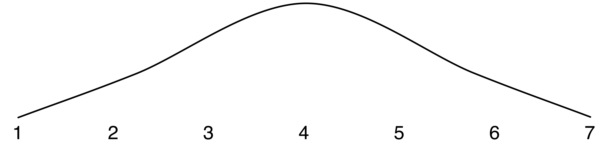

# What to Do When Your Data Tells You There Is Something Wrong with the Universe

_Nenad Medvidovic_, University of Southern California
 
_Alessandro Orso_, Georgia Institute of Technology

## Prologue

In "Remember Me", an episode of _Star Trek: The Next Generation_, Dr. Beverly Crusher does not realize that, due to a science experiment gone awry, she has ended up inside a spacetime disturbance.  After a series of unexpected and, to her, unexplainable events, she tries to calm herself and assess her situation in order to find a way out of it.  Thinking back over what has transpired, Dr. Crusher states: "If there's nothing wrong with me, maybe there's something wrong with the universe!"

This is an extreme conclusion, and in this instance obviously the wrong one.  Yet, the scientist, frustrated by her inability to understand the observations she has made inside the spacetime disturbance—i.e., the data she collected “with her own eyes and ears”, with her handheld tricorder, and via the countless sensors on the Starship Enterprise—actually considered this possibility.  Fortunately, the episode had to be concluded in 45 minutes and, as always, one of the main characters had to be saved.  Otherwise, Dr. Crusher may still be trying to resolve her predicament based on incomplete data, lack of awareness of the precipitating event, and analysis of the available data from the wrong perspective: she was unaware that she got pulled into the spacetime disturbance and that, in the world of Star Trek at least, the usual laws of physics did not apply there.

How does this relate to the problem of Big Data in software engineering?  Very closely, actually!  First, we are practitioners of a “science of the artificial”, meaning that we cannot rely on laws of physics or their analogs in understanding the phenomena we are studying. Second, very often, we do not understand the precipitating events for the phenomena in which we are interested, either because that data was never recorded or because nobody actually realized at the time that they had encountered something important.  Third, despite the seemingly huge amounts of data we can now collect about a system, the humans who built it, and the project from which it resulted, by definition that data is incomplete; we are often looking for “second-order events” because the actual phenomena we are interested in have not been recorded or are altogether unobservable.  Finally, we bring our biases to the processes of data collection and analysis.  In other words, we (consciously or otherwise) select the perspectives from which we collect and analyze the data, and those perspectives inevitably color our conclusions.

In the remainder of this chapter, we will describe the landscape of the research in and applications of Big Data in software engineering.  Our objective is to provide a general overview that can be used to categories existing work in this area, but we do not engage in such a categorization.  Put another way, while we deliberately do not focus on specific projects, our discussion is informed by the work that has appeared in various software engineering venues over the past decade.

##Learning from Data 

There is a range of conclusions one can draw from data.  While the discussion below may be generally applicable, our particular interest is in the role and potential impact of conclusions drawn specifically within software engineering Big Data projects.  To the extent possible, we urge the reader to approach the below discussion in that vein. 

###1. Incorrect Conclusions
This can happen because of reliance on incomplete, tainted, and/or noisy data, poor statistical analysis, wrong inferences, and overgeneralization.  Some of these pitfalls (e.g., bad statistics) can be remedied through appropriate training.  Others (e.g., bad data) cannot be remedied as readily.  Acting on incorrectly drawn conclusions can have serious consequences.

###2. Partially Correct Conclusions
Conclusions regarding complex phenomena may be correct in certain respects, wrong in others. Basing important decisions on them may be as detrimental as acting on completely incorrect conclusions.  Especially in software engineering, the extent of our current understanding of the factors that yield such (partially) incorrect conclusions is limited at best.  This is certainly exacerbated by the attitudes of researchers, who prefer to highlight positive results.

###3. Correct But Useless Results
Certain phenomena, while analyzable, are not worthy of analysis.  They provide answers to questions that are not worth asking in the first place.  Many examples of "low hanging fruit" fall in this category.  They are often attractive because they are easy.  They should be avoided just the same.  Put another way, if a paper "practically writes itself", one should let it and move on to something else.

###4. Correct But Obvious Results
Certain phenomena may be worthy of analysis, but only if it is not already clear ahead of time what results the analysis will yield.  Empirically confirming a hypothesis or a suspicion, even if they appear well founded and likely, is an important part of science.  Answering questions that have already been answered, or that can be answered much more quickly and easily than through a given Big Data-based procedure, is wasteful. 

###5. Correct But Not Readily Usable Results
Analysis of certain phenomena may correctly yield conclusions that are not at all obvious.  However, those conclusions may be "dead ends" in that they are neither usable to practicing engineers nor do they form a foundation for further studies.  In such cases, the analysis is little more than an intellectual exercise ("we do it because we can") and its authors are susceptible to accusations of living in the proverbial ivory tower.

###6. Correct, Non-Obvious, Modest Steps
On the other hand, certain conclusions may enrich an engineer's palette of methods, techniques, and tools.  Even a moderate improvement over the current state-of-the-art is valuable, regardless of the complexity of the underlying analysis that yielded that improvement.  The assumption is, of course, that the complex analysis was not undertaken in lieu of a simpler, much more straightforward approach that would have yielded the same answers (see above).

###7. Correct, Non-Obvious Game-Changers
This is the "holy grail" of Big Data research and practice.  Such a result changes how researchers think about and approach their field, as well as how engineers think about and do their work.  It is likely a combination of painstaking work, subtle insights, unique perspective, and luck.  It is not necessarily repeatable.  It cannot be forced and at least some parts of it cannot be taught. 

##Which Bin Is Mine?

If one were to look at the principal risks faced by Big Data research in software engineering, it is that the existing research results, when clustered into the above seven areas, will form a bell curve as shown in the below diagram.  Note that the most beneficial work is in categories 6 and 7, yet only a small fraction of research falls there.  Another observation is that wrong results (category 1 and, to a lesser extent, 2) can be very useful in that they inform future research and help to avoid repeated mistakes.  However, very few such publications are typically produced, precisely because "negative results" are not readily accepted as worthy.  "Spinning" what we see as positive outcomes while disguising or hiding the negative outcomes  is harmful to our community, including the authors of such a study.


