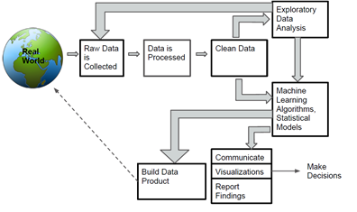

# A Success Story in Applying Data Science in Practice

_Ayse Basar Bener, Burak Turhan, Ayse Tosun, Bora Caglayan, Ekrem Kocaguneli_

In software engineering the primary objective is delivering high quality systems within budget and time constraints. Managers struggle to make many decisions under a lot of uncertainty. They would like to be confident on the product, team and the processes. Therefore, evidence-based decision making, a.k.a. data science and analysis, has been a growing need in the software development industry as data becomes available. Data science involves analytics to use data to understand past and present, to analyze past performance and to use optimization and/ or prediction techniques [1]. 

In the past couple of decades in our research lab (formerly Softlab, now Data Science Lab) we have been working with small to large scale software development organizations to conduct data science and analytics projects. These projects involve gaining insights into the daily processes, building learning based predictive models to improve resource planning and allocation. 

Software analytics must follow a process that starts with problem identification both framing the business problem and the analytics problem. Throughout this process, stakeholder agreement needs to be obtained and/ or re-obtained through effective communication. The end goal for any software analytics project should be to address a genuine problem in the industry. Therefore, the outcome of the analytics project could be transferred and embedded into the decision making process of the organization [1].

We have been collaborating with one of our research partners since 2007 to build a comprehensive metrics and measurement system, and then to build learning based predictive models for defect prediction, code dependency/ missing dependency prediction, issue allocation, technical debt, etc. The company employs incremental software development process that they have a new release every two weeks. Therefore, they need an end to end measurement and analysis approach to predict defects in order to better organize their testing resources. 

This chapter offers an overview of this process.

## Overview

In this work, our client's main software engineering problems were measurement, effective testing, reliability, process and project management, and human resources management. Over the years, we deployed many predictive models addressing these problems. We have constantly been providing software analytics by mining various data repositories of the company. Some of the models we deployed have been successful and we conducted before and after cost/ benefit analysis of the deployed models [2]. In most cases the output of the analytics has led to process changes and more effective and timely release decision making under uncertainty. We reported successes and failures, lessons learned as well as the direct feedback from the developers and managers of the organization to understand the reasons of failures [2, 3]. 

Phase 1: In the early days of our collaboration we first tackled the problems of code quality improvement, reducing the testing costs, and decreasing the defect rates. Our solution was an implementation of bug tracing and matching system, measurement and data extraction tool (Prest), and a defect prediction model [3, 4, 5, 6]. We have done a comprehensive analysis to validate the need for an intelligent oracle (i.e. a learning based prediction model). 

*  First we analyzed the raw data by extracting metrics from the source code. We compared metric ranges with the one on NASA datasets [9] as the benchmark. This analysis gave us a picture of common code writing practices in the company. For example we found out that lines of comment/ code, and vocabulary were low, and modularity was high. 
*  Second we estimated the testing effort in terms of what amount of code should be reviewed, and how much testing effort we need to inspect modules. 
*Third we constructed a rule-based model as an alternative to a learning based model. The rule-based model required them to inspect 45% of code in order to detect 15% of defects. This was not practical considering their release cycles. 
*Mining their code repository revealed a hidden factor; static code dependencies as an effective feature leading to defect proneness of the software. We included call graph metrics based on PageRank algorithm in building the defect prediction model. This has increased the information content of the predictive model and it resulted in decrease in testing effort by additional 4%. In the overall the prediction model that we built was able to detect 70% of the bugs by inspecting only 3% of the code. This has resulted in 95% improvement in the testing effort. We also used the same prediction model to determine candidate software classes for refactoring instead of predicting defects in the upcoming releases by focusing on the complexity metrics[7]. In this case our predictor was able to detect 82% of the refactored classes with 13% of manual inspection effort on the average. 

Phase 2: The second phase of the project focused on mining different sources of data and metrics to improve the information content of the prediction model as well as gaining new insights from the data. These new sources of data included mining version histories, extracting call graphs on the entire code base so that version-based and application-based defect prediction models could be built. In this phase of the project we used churn metrics and call graph metric to improve the false alarm rates. Mining different data sources and model calibration kept the detection rates constant compared to Phase 1 results of the project, however, it improved the false alarm rates by 15% translating into a further 25% improvement in testing effort. 

Phases 1 and 2 of the project not only fully met their project objectives and provided tangible benefits to the company there were also additional benefits as a result of new insights gained through data science and analytics: process changes in defect monitoring and matching; development of metric extraction and analysis tool, Prest [5]; a detailed analysis of different software development of methodologies and their impact on code quality; and refactoring prediction. 

Phase 3: This phase of the project focused on building a reliability model as we called it ‘confidence factor modeling’. The problem was to predict confidence level of a given release before it is put into production. The company was using a linear formula based on expert biases. In this phase we built a Bayesian network model to predict the confidence level of a release in pre-production. Such a model enabled the managers to better understand causal relationships using data and algorithms, and make an informed decision on when to stop testing. Our model was able to accurately predict the confidence level of releases based on post-release defect severity [4].

## Analytics Process 

As we reported in our earlier publications successful deployments of data science and analytics in this particular project with our industry partner followed a process (Figure 1) and had the following characteristics. In our previous publications we focused on the aspects of communication with the management, the development teams to share our experience in terms of lessons learned. In this chapter we tell the story from a data science process point of view. 
Data collection.

It requires identification and prioritization of data needs and available sources depending on the context. Qualitative and quantitative data collection methods may be required depending on the problem. In some cases data acquisition demands a tool development first, followed by harmonizing, rescaling, cleaning and sharing data within the organization.

 

Figure 1.  The data science and analytics process [8]

### Exploratory Data Analysis

The simplest way to get insight from data is through descriptive statistics. Even a simple analysis or visualisation may reveal hidden facts in the data. Later, predictive models utilizing data mining techniques may be built to aid decision making process in an organization. 

### Model Selection 

Selection of the suitable data mining techniques depending on the problem is critical while building the prediction model. Factors such as the definition of the problem, maturity of data collection process in a company and expected benefits from the predictive model may also affect model construction. In addition, insights gained from descriptive statistics may be used in the construction of predictive models [1]. 

### Performance measures and benefit analysis

Predictive models need to be evaluated, which requires the definition of certain performance measures, appropriate statistical tests as well as the effect size analysis [1]. 
##Communication Process – Best Practices

### Problem Selection

 In problem selection we need to ask the right or important questions. It is important to involve the domain expert and/ or the practitioner at this stage. We need to make sure that the hypotheses are consistent with questions since these will be the basis of the ‘statement of problem’. Failing to ask the right questions and inconsistencies in hypothesis formulation also would lead to methodological pitfalls such as hypothesis testing errors, issues of statistical power, issues in construction of dependent/ independent variables, reliability and validity issues.
 
 ### Tool Support
 Having an automated tool support such as Prest [5] made it easier and faster to access the data.

### Managerial Support

As in any project data science projects need full support of management at all levels.

### Project Management
It is important to have a detailed project planned signed off by all parties. Once the project plan is in place it needs to be rigorously monitored in order to be able to take corrective action on a timely basis if there are challenges. 

### Trusted Relationship

We have been collaborating with this company since 2007 and it is now a mature and trusted relationship. Such a relationship makes it easier to communicate easily at different levels and hence helps the researchers to better understand cause-effect relationships. 

## Summary

In a period of nine years our research lab successfully graduated 3 PhD, 4 MSc students who worked in collaboration with this company. On both sides we created an open environment to share knowledge, formulate problems, and solve problems as one team. On our part we made a great effort to understand their problems and help them achieve their goals so that they had seen the benefit of the output of our models in their daily processes. 

Most of the time we went beyond our defined research contract/ objectives to accommodate a need on their part. Our tool, Prest and Dione, is one good example that we built a data extraction and analytics tool to provide developer level support. Over the course of 9 years there were times that we faced push backs especially when the company went through major organization changes a few times. Once a push back occurred we self-reflected and used data science to our benefit. We learned from our own mistakes, and also showed the new team the tangible benefits (before/ after analyses) of using our models, tools, and techniques. Trust is built over a period of time by going through difficulties together. In this specific case, the company has continued to collaborate with the new research lab (lead by Prof. Bener), Data Science Lab in Toronto by giving us remote access and meeting slots over Skype.

The bottomline of the above is to focus better on understanding of the data (contrary to classical machine learning applications). Each phase of the project at the end led to a new project and a new collaboration. Although AI techniques may be complex for practitioners with a tool support and a proper measurement of tangible benefits the industry uses data science and analytics very effectively [3]. 

## References:

1.  A. Bener, A.T. Misirli, B. Caglayan, E. Kocaguneli, G. Calikli, Lessons Learned from Software Analytics in Practice, in The Art and Science of Analyzing Software Data, Tim Menzies, Christian Bird, and Tom Zimmerman (eds.), Morgan Kaufmann 2015.
2. T. Misirli, B. Caglayan, A. Bener, and B. Turhan “A Retrospective Study of Software Analytics Projects: In-Depth Interviews with Practitioners”. IEEE Software, September/ October, 2013
3. A. Tosun, A. Bener, and R. Kale, “AI Based Software Defect Predictors: Applications and Benefits in a Case Study”, AI Magazine, 32, 2, pp. 57-68, (2011).
4.  A.Tosun, B.Turhan, and A. Bener, “Practical Considerations of Deploying AI in Defect Prediction: A Case Study within the Turkish Telecommunication Industry”, Promise09, May 18-19, Vancouver, Canada
5. E. Kocagüneli, A. Tosun, A. Bener, B. Turhan, and B. Çağlayan, “Prest: An Intelligent Software Metrics Extraction, Analysis and Defect Prediction Tool”, in Proceedings of the 21st International Conference on Software Engineering and Knowledge Engineering (SEKE 2009), Boston, USA.
6. B.Turhan, G. Kocak and A. Bener, "Software Defect Prediction Using Call Graph Based Ranking (CGBR) Framework", in Proceedings of the 34th EUROMICRO Software Engineering and Advanced Applications (EUROMICRO-SEAA 2008), 2008.
7.  Y. Kosker, A.Bener and B. Turhan, "Refactoring Prediction Using Class Complexity Metrics", in Proceedings of the 3rd International Conference on Software and Data Technologies (ICSOFT 2008), 2008, pp. 289-292.
8.  Shut, R. (2013), “Next-Gen Data Scientists”, Strata Talk, Feb 2013
9.  “Nasa/ Wvu IV&V Facility, Metrics Data program, available form http://mdp.ivv.nasa.gov”, Internet; accessed 2007.
