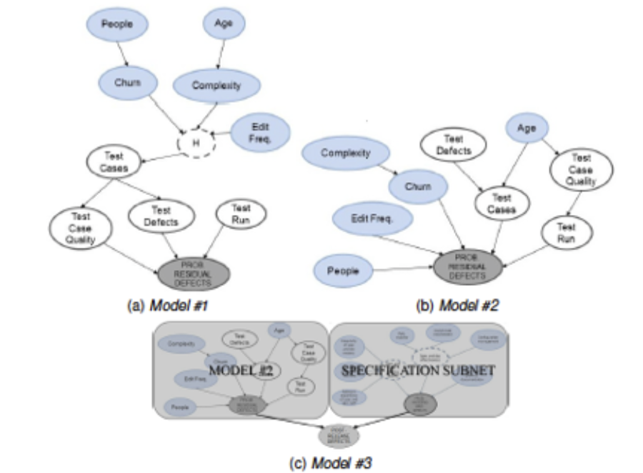

# The Bayes Factor in Software Engineering Practice

_Ayse Bener and Ayse Tosun_

For more than two decades we have been developing software in the industry and later conducting empirical research in academia to build predictive models, mine software repositories and perform various software analytics tasks to help software development teams to make evidence based decisions.

As we discussed in our previous work, over the years we have come to the conclusion that in software engineering domain we need different approaches to solve problems in the field in a real-time fashion. These approaches may be modification of existing AI-based algorithms that go beyond the capabilities of human reasoning, are evolved through iterative user feedback, and they can present the results in a simple, easy to interpret way [1]. In different contexts such as big data, researchers argue that next generation models with AI should not only be capable of identifying relationships from observed data and ‘predicing the future’ but also should be ‘causing the future’ by studying all possible scenarios (relations and their effects on final outcome), and determining the best future scenarios in terms of cost, accuracy, and time [2]. 

Bayesian Networks (BN) offer a unique solution to the next generation of AI usage on real data since they have the ability to encode causal relationships (for predicting the future) and to go one step further with its property of ‘information propagation through the network’. This property makes it possible to understand the entire system such as how a change in one variable can affect the others, and how important certain variables in a network are, and start gaming over the network to see which scenarios would give the best outcome (what is called ‘causing the future’). Thus, BNs provide real-time solutions that are beyond the capabilities of human reasoning and present them in a simple, easy to interpret graphical models [3].

BNs have been rigorously used in many disciplines such as health care and medicine that are more mature disciplines in terms of research design and guidelines. Similar to healthcare, evidence based software engineering must put this research approach into practice in order to support and improve the decisions made by software practitioners on the usage and adaptation of a specific technology [1]. Earlier work on BNs in software engineering included validating dependability of software based systems, estimating system reliability, making resource decisions, modeling project trade-off, and estimation software effort [4, 5, 6, 7, 8, 9].

We need to recognize the fact that software intelligence provided by academia in the form of prediction models, software analytics, etc. should aim to help practitioners explain large volumes of data, understand what works and what does not in practice that would also let them make better decisions. These models should use the power of AI techniques, produce fact-based, faster, error free solutions, and hence help practitioners by reducing their workload during decision making and analysis. However, none of these models replace practitioners; instead they evolve via iterative feedback by practitioners. So a hybrid approach considering both the output of AI based models and user knowledge is essential. 

In our previous work we used the power of BNs to solve a specific problem of predicting software reliability, combine the power of Bayesian statistics and expert knowledge, and build hybrid models that can easily adopt to the environment depending on the amount of local data in software organizations [1]. We observe that existing models in the literature are built based on expert knowledge including defining a set of metrics through surveys and causal relationships. We overcome their limitations by introducing new data collection, model construction and inference methodology. We collected both qualitative and quantitative data in building the BN to estimate the reliability of consecutive releases of software projects before a release decision, in terms of their residual (post-release) defects. We built this causal network by modeling the relationship between major processes of a software development life cycle (SDLC) and residual defects (Figure 1). 

Figure 1. Graphical representation of BN

During data collection we realized that collecting data from all software processes was not feasible. On the other hand, quantifying processes with survey data also has a bias due to subjective judgments of the software team as their experience and qualification is diverse. Therefore we used a hybrid data collection approach by using quantitative data that we extracted from the organization’s software repositories as well as the qualitative data that we collected through surveys. We built a Hybrid BN in order to handle mixture of continuous and categorical variables in a single model such that categorical variables can be parents of continuous variables. A Hybrid BN also handles continuous variables without transforming them (i.e. discretization). This also helps to avoid potential biases due to discretization in small state spaces such as software engineering datasets.

In this work our industry wanted to decide ‘when to stop testing and release the product”. Therefore we aimed at predicting software reliability by learning the probability of residual defects given observations from software metrics. This probability needed to be computed from BN’s as it is know as the ‘inference’. We used Gibbs sampling, a well known Monte Carlo technique on approximation of the joint probability distribution over conditional distributions. Gibbs sampling is well suited for inferring posterior distribution in a BN handling mixture of continuous and categorical variables as well as handling missing data. Missing data in surveys is a common problem and we had missing data in our surveys as well. 

Our findings in this study showed that the effects of software processes and their relationships on software reliability are worth the investigation. We also observed that local data is very valuable as expert knowledge such that in software organizations with a mature measurement/ metrics data repository, local data should be used primarily and strengthened with expert knowledge when predicting software reliability. Construction of the BN gave us some insights to understand the factors that affect software reliability. We used different metrics to cover 3Ps (people, process, product) aspects of SDLC. Apart from a BN model we built a generalized linear model where each metric affects final reliability independently. We have seen that causal models such as BN are better at predicting software reliability than linear models as they capture 3Ps and the causalities among them. The BN model in our industry partner predicts 84% of post-release defects with less than 25% MRE. 

In practice software organizations need predictive models to make release decisions. Using estimated post-release defects and the company’s pre-determined threshold for software reliability, it is possible to estimate a release readiness level for each release. This threshold helps managers to make a decision either to release the software, or to delay the release, or to cancel the release. Measuring/ quantifying software processes helps software organizations to build a measurement repository and monitor trends of development practices in a systematic way. Our experience in building BNs in different organizations showed that there are not a specific set of metrics that should be used in any software development organization to predict reliability in terms of post-release defects. However, it would be useful to extract a common set of metrics that are significant indicators of post-release defects. Causal relationships also change from one model to another based on local data collected from the organization. Hence we suggest practitioners to follow a methodology rather than using same metric sets with same causal relationships among each other. 

In research we use several performance evaluation measures. However, in real life, practitioners prefer a single measure in order to judge their model in terms of its prediction performance. In that case Pred(k) measure is a good one since it would evaluate the overall success of a model in terms of variance of its predictions’.

We have also conducted a systematic mapping study of BNs in software engineering [3]. Our experience in industry as well as the findings of the systematic review showed that there is a need for a systematic approach in building BNs. The dataset characteristics, source of data and types of input and output variables would be important in:

1.	identification of structure learning techniques to model cause-effect relationships between variables, and the rationale of choosing the selected technique, and in 
2.	identification of parameter learning, with respect to 
    a.	how to set the prior distributions, and 
    b.	how to estimate the final parameters of the model (inference), and the rationale of choosing the selected technique. 

As always the tool support and tool selection is also an important consideration for adoption and sustainability of a given technique/ model in the industry.

Similar to computational biology and healthcare, we need to make decisions under uncertainty using multiple data sources. As we understand the dynamics of BNs and the techniques used for model learning, and inference, these models would enable us to uncover hidden relationships between variables, which can not be easily identified by experts [1]. BNs will help us determine how scientific belief is modified by data. In the software engineering/ software analytics community (both academia and practice) we should embrace BNs as a method for evidence based statistics to be used in inference and decision making. 

References

[1] Misirli, A. T., and Bener, A., “Bayesian Networks For Evidence-Based Decision-Making in Software Engineering”. IEEE Transactions on Software Engineering, vol.40, no.6., June 2014.

[2] Schutt, R. (2012). 10 IMPORTANT DATA SCIENCE IDEAS. http://columbiadatascience.com/2012/10/15/10-important-data-science-ideas/ .

[3] A. Tosun, A. Bener, and S. Akbarisinaji, “A Systematic Literature Review on the Applications of Bayesian Networks to Predict Software Quality”. Software Quality Journal, in print.

[4] Littlewood, B., & Verrall, J. (1973). A Bayesian reliability growth model for computer software. Applied statistics, 332-346.

[5] Fenton, Neil, M., & Marquez, D. (2008). Using Bayesian networks to predict software defects and reliability. Proceedings of the Institution of Mechanical Engineers, Part O: Journal of Risk and Reliability, 222 (4), 701-712.

[6] Fenton, N., Marsh, W., Neil, M., Cates, P., Forey, S., & Tailor, M. Making resource decisions for software projects. In Software Engineering, 2004. ICSE 2004. Proceedings. 26th International Conference on, 2004  (pp. 397-406): IEEE

[7] Fineman, M., Fenton, N., & Radlinski, L. Modelling project trade-off using Bayesian networks. In Computational Intelligence and Software Engineering, 2009. CiSE 2009. International Conference on, 2009  (pp. 1-4): IEEE

[8] Mendes, E. Predicting web development effort using a bayesian network. In Proceedings of EASE, 2007  (Vol. 7, pp. 83-93)

[9] Mendes, E., & Mosley, N. (2008). Bayesian network models for web effort prediction: a comparative study. Software Engineering, IEEE Transactions on, 34 (6), 723-737.

