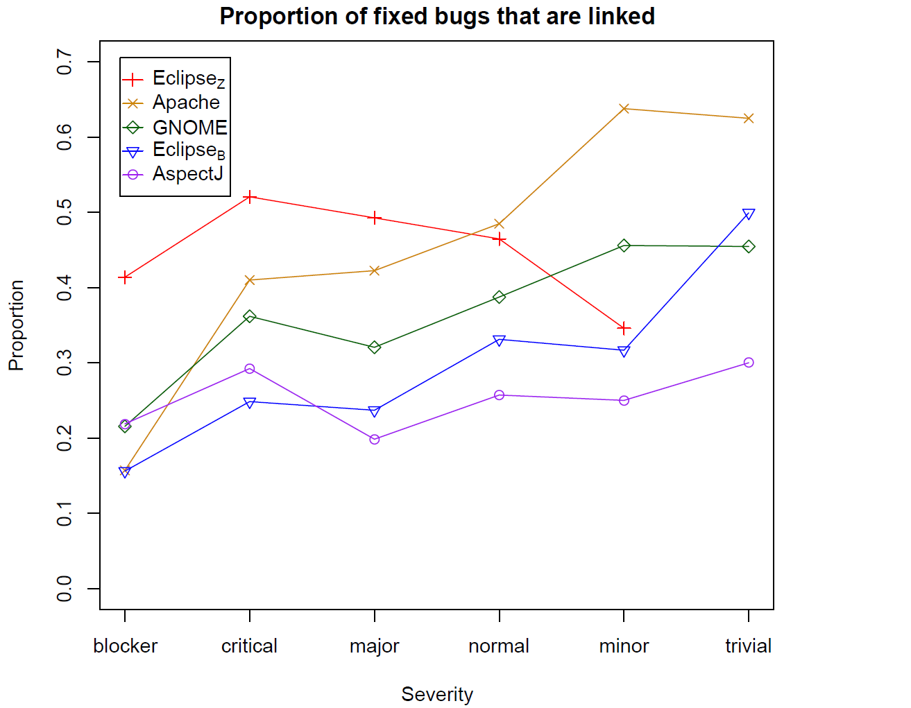

# Don't embarrass yourself: Beware of bias in your data

## Dewey Defeats Truman

The 1948 U.S. presidential election proved to be one of the greatest blunders in applied statistics history.

As is often the case, many polls were conducted in the run up to the election. Gallup, still one of the most trusted polling organizations today, predicted that republican Thomas Dewey would handily defeat democrat Harry Truman.  In fact, the press was so convinced by the "empirical evidence" that the Chicago Daily Tribune had already printed the first edition of the paper with the headline "Dewey Defeats Truman" before final election results were in.  Unfortunately for them, the election results the next morning were anything but expected, as Truman had won the electoral vote with 303 votes to Dewey's 189.  A landslide, but in the opposite direction.

  

In the modern era of data collection and statistics, how could such a thing have happened?  The answer lies not in the analysis of the data, but in the hidden biases it contained.  Consider just one of many errors in the polling methodology.  Like today, polling was conducted by selecting people randomly and contacting people via telephone.  However, in 1948 telephones were mostly owned by individuals who were more financially well-off. At that time those with higher income levels tended to lean republican.  While the polling was indeed random, the population sampled (people that had telephones) was biased with respect to the entire voting population.  Thus any results drawn from the polling data were similarly biased.  The problem has not completely been solved even today as certain demographics may be more likely to answer the phone or less likely to vote.

This is an interesting cautionary tale, but surely such a mistake couldn't happen in the 21st century on data drawn from software engineering...

## Impact of Bias in Software engineering

Unfortunately, bias exists in software engineering data as well.  If left unchecked and undetected, such bias in data can lead to misleading conclusions and incorrect predicitons.

A few years ago (Bird, 2009), we examined defect data sets to determine if there was bias in the "links" between a defect in the defect database and the corresponding defect correcting change in the source code repository.  Knowing which code changes fix which defects can be quite valuable because this can provide much more context about a code change and also allows us to determine which prior code changes actually introduced a bug.  It also allows us to see who is introducing the defects, who is correcting the defects, and what types of defects are corrected in different parts of the code base.   Research has shown that this information can be used to learn characteristics of code changes that lead to defects CITE or teach machine learning methods to accurately predict where in the source code a defect is based only on the bug report CITE. Because of the value of these "links", a long line of research exists on techniques to infer these links.  See Sliwerski et al for one of the most well-known examples (Sliwerski, 2005).  In our study of these links in five software project, we found that there was bias in the severity level of defects that could be linked to defects in four of the projects.  That is, the lower the severity level for a fixed bug, the higher the likelihood that there was a link between the defect and the commit.  As an extreme example, out of all defects labeled "minor" in the Apache Webserver that were indicated in the defect database to have been fixed, we were able to identify the corresponding fixing commit for 65% of them.  In contrast, for those bugs in the category of "blocker" that were fixes, we were only able to find the fixing commit 15% of the time.

The following graph shows the proportions for all projects; not that AspectJ is appears to suffer far less from bias in bug severity for links between defects and commits.

  

While we identified bias in the data, what's worse is that this bias appeared to affect the results of research that used the data.  We used the linked defects and fixing commits to train a defect prediction model (a statistical model that would predict what parts of the code was most likely to contain defects).  When we evaluated our prediction model, it was much better at predicting those defects that had lower severity than those that had higher severity.  In practice, one would likely prefer a machine learning method that points to likely defective areas in the code to either be agnostic of the severity of the defects or favor indicating locations with higher severity defects.  We were getting the opposite due to bias in the data.  Inadvertently using biased data can impact the quality of tools or models and the validity of empirical findings.

## Identifying bias

The first step in avoiding the use of biased data is in determining if bias exists in the first place.  This can be done via visualization or statistics, but often requires some a priori knowledge or expectations about the data as well.  To do this, you first decide what *feature* you are interested in examining.  A feature is any individual measurable property of the data or phenomenon being observed.  Concretely, features of defects in a defect tracking system can include (but are certainly not limited to) the severity, how long it took for a defect to be fixed, who fixed the defect, and the textual summary of the defect.  Features of a source code commit could include the number of lines in a change, the person that made the change, the type of file or files being changed, and whether a comment was added to the code.

In the best case scenario, you may have information about the distribution of an important feature in the population.  In the study of defects, we had the severity levels for all fixed defects in a project.  This forms our *population* distribution.  We then compared that to the severity levels for fixed defects that we could find the corresponding commits for, our *sample* distribution.  Generating histograms for the population and sample severity distributions is relatively easy to do in R or Excel and if there is bias, it is often easy to spot visually using such visualizations.  One nice aspect of using histograms is that they work for both categorical *and* numerical data.  

Statistically, one can compare distributions of categorical data using a Pearson's chi-squared test or a Fisher's exact test. Both are readily available in any statistical environment such as R, SPSS, or SAS. For numerical data, the Kolmogorov-Smirnov test (also called the K-S test) can tell you if there is a statistically signficant difference between the two populations.  Note that in all of the above cases, the result of the test is a likelihood that the two distributions come from the same population (a so called p-value).  The tests *do not* indicate how the distributions differ (e.g., which way a sample is biased or which category is over-represented).  It is up to you to investigate further and determine what exactly the bias is and how extreme it is.

While statistics can help, it is important that you understand the data being collected and that you know what you expect to see in the data and why.  In our study, we examined the way the development happened and that defects were fixed and based on our knowledge of the projects, we believed that each defect that was fixed should have the same likelihood of being linked to a commit as any other.  However, consider a software project where minor bugs are assigned to junior developers and their fixes must be reviewed by senior developers.  In this case, it may make more sense that minor bugs would be explicitly linked to their commits (for review) and so our expectations would be that lower severity defects have a higher link rate.  Understanding your data and the processes that it came from can aid greatly when examining your data visually or statistically for bias.

Unfortunately, you may not always have in depth knowledge about how some characteristic of your data.  In the absence of information about the population, distributions from samples expected to be similar could be used.  For instance, if you are examining the number of developers actively contributing to Python over the past year, you could compare the distribution of active developers this year to previous years for Python.  You might also compare it to other projects that you consider to be similar to Python in some way such as Perl or Ruby.  For these types of comparisons, statistical tests are unlikely to provide much value, as the distributions will likely be different to some degree and that may not indicate real bias.  A visual inspection will help you determine if they are different enough to warrant further investigation.

If you lack any other distribution for comparison, the best approach is to calculate descriptive statistics from your sample, visualize the sample via histograms, pdfs, or boxplots, and make a judgement as to how well the distribution of a feature matches your expectations.  If they differ widely, then either the data or your expectations are incorrect.  In both cases, you should likely "dig in" and do some more manual investigation into where the data came from, how it was produced, and anything that may be out of the ordinary.

As a concrete example, consider an investigation into the impact of experience on the time to complete tasks in two software projects.  One of the first steps would be to collect the years of experience for developers in the two projects.  

## Assessing Impact

Just because bias exists in a data set does not mean that the bias will have an impact on the results of using the data.  In our study above, we found that when defects used to train a model were biased with respect to severity, the predictions from the model were also biased in a similar way.  However, consider a defect model trained on defects that were fixed mostly (though not completely) on even days of the month (e.g. January 2nd, October 24th, etc.).  While the data is biased with regard to the parity of the fix day, it is unlikely that such a model would do much better when evaluated on defects fixed on even days than on defects fixed on odd days.  

How could we assess the impact of the bias?

If we had access to all defects for all days, that would help.  We could train one model on the biased sample and another on the larger less biased sample and look at the difference to assess the impact of the bias.  However, usually if we have a biased sample, we don't have access to a larger less biased sample.  In the absence of this less biased sample, one approach is to select subsets of your sample such that they are biased in different ways.  In the above example we could remove all of the odd days so that the model is *only* trained on defects fixed on even days.  Does the performance of this second model differ from the original model?  What about training the model only on days that are multiples of four or ten?  These are "super-biased" data sets. We could go the other way and create a subset from our sample that has the same number of defects fixed on odd and even days.  Does a model trained on this data set perform differently?  If we see (as I suspect we would), that the amount of "day parity" bias does not affect model results, then we may not need to worry about the bias.  If in your investigations, you find that there *is* a feature (such as age of a developer, size of a commit, or date of a defect report) that is biased and that does effect the results of a study, accuracy of a model, or utility of a technique, you are not completely out of luck.  This just means that the bias needs to be reported so that others consuming your research have all salient facts they need.

## Which Features Should I Look At?

Having said all of this, an additional key question to ask is what features to examine for bias.  Data collected from software repositories have nearly endless dimensions (features).  A developer working on a project has an associated age, gender, experience level, education, location, employment history, marital status, etc.  A code review has an author, a date, the contents of the changed code, the phase of the development cycle it occurs in, the files that are modified, and the number of lines changed.  These are just a few of the features that exist for just a few of the artifacts that may be examined as part of a research endeavor.  Exhaustively investigating bias for all possible features will take an inordinate amount of time and most of that time will be wasted.  

A better approach is to start by reading related research and brainstorming those features that you hypothesize may be related to the outcome of interest.  That is, if you are conducting a study related to collaboration of developers, identify those features whose bias you believe is most likely to impact results and validity.  Next, identify those features that you can actually measure in your data (sadly, this often a much shorter list).  Then rank these features and investigate them as outlined in this chapter.  Whether or not you do find bias, be sure to report your investigation and the outcome in any publication, most often in a "Threats to Validity" or "Evaluation" section.

## References

 + Bird, Bachmann, Aune, Duffy, Bernstein, Filkov, and Devanbu. "Fair and Balanced? Bias in Bug-Fix Datasets", Proceedings of the ACM SigSoft Foundations of Software Engineering. ACM. 2009
 + Friedenson, Bernard. "DEWEY DEFEATS TRUMAN and cancer statistics." Journal of the National Cancer Institute 101.16 (2009): 1157-1157.
 + J. Sliwerski, T. Zimmermann and A. Zeller, "When Do Changes Induce Fixes? On Fridays," Proceedings of the International Workshop on Mining Software Repositories, 2005. 

