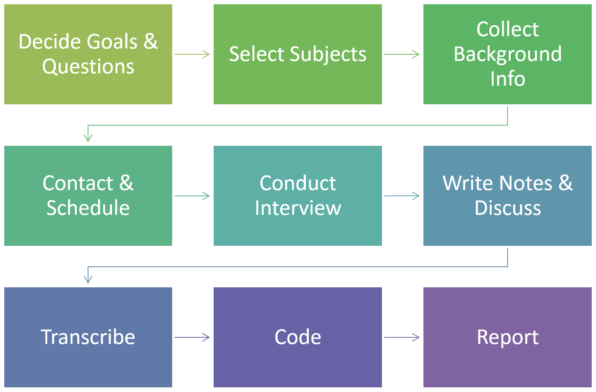
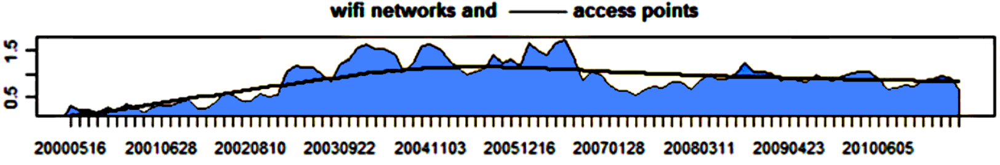

# Interviews

## Why Interview?

Two years ago I was investigating code review latency at Microsoft.  In the process of analyzing data from code reviews, I found something odd in the data for a team in Bing.  Many of their code reviews were signed off just minutes (sometimes *under* a minute) after the code review was created.  That couldn't be right! I meticulously looked at the data collection code to see if there was an error.  I manually looked at the reviews in question to try to see how and why the reviews were signed off so fast.  I conducted a number of experiments on the data based on guesses that I had.  All to no avail.  As a last resort, I contacted one of the developers on the team and scheduled an interview.  When we talked, He explained that the reason for the lightning fast reviews was that they often conduct code reviews in person with two or three reviewers huddled around the developer's screen as he explained the change.  Once the reviewers were happy, the author would create the code review in the review system and the reviewers would immediately sign off on the review.  The code review as manifest in the system didn't actually reflect how code review was being done by the team.  It hadn't occurred to me that this might be the reason for my data anomaly and if I hadn't taken the time to actually ask the developer I still wouldn't know.  In just a few minutes, he had answered a question that I hadn't been able to answer after hours of testing hypotheses on data.  In my view, this is one of the primary benefits of doing interviews.   Unlike quantitative approaches where you must have some idea or hypothesis ahead of time (you can't compute a metric or run a t-test without first deciding what you want to measure or test), you can learn things in an interview that you would never have thought of yourself.

We have found that interviews can be wonderful tools for exploratory investigation and they often can drive the formation of theories and hypotheses that we can then use complementary quantitative methods to further investigate and support.  Interviews allow rich engagement and follow up questions.  You can collect historical data that is not recorded anywhere as well as elicit opinions and impressions in richer detail than people would provide through written communication.  Information from interviews can be triangulated with other data sources.  In addition, interviews can be used to clarify things that have already happened (especially following an observation).  In short, the interview can be an important tool that you should have in your research toolbox.

Generally, when we include interviews in our research, we follow the steps in the workflow below, though some steps may be omitted based on the context, goals, and specifics of the study.  In this chapter, I'll provide a description and best practices for each phase based on experiences that we have had conducting interviews for software engineering research at Microsoft.  

  

## The Interview Guide

Creating an interview guide helps interview research in a number of ways.  An interview guide is simply a list of the high level topics that you plan on covering in the interview with the high level questions that you want to answer under each topic.  We usually limit the guide to one page so that it's easy to refer to and to make sure that we're not getting too low level.  The process of creating such a guide can help to focus and organize your line of thinking and therefore questioning.

When conducting the interview, we always bring a fresh copy of the guide so that we can easily cross off questions or topics as they are covered.   Often we find that some questions are answered during the course of our conversation with the interviewee without even asking.  Using the guide, I can check off the question on the guide so that we don't ask it explicitly later. It is important to remember that the interview guide really is only a *guide*.  You don't have to follow the exact ordering and there's nothing wrong with "going off script" at times if a particular line of questioning that you hadn't anticipated seems worthwhile.  You may also decide partway through that an entire line of questioning isn't appropriate for a particular interviewee.  However, the guide can help you with pacing during an interview.  If you're ten minutes into a thirty minute interview and you realize that you've only covered one topic out of the five on your guide, then you still have time to get back on track.

## Selecting Interviewees

While random sampling of a population is a good choice when doing quantitative analysis with a large sample, it is not the best approach when selecting interviewees.  Due to the time and effort required in conducting interviews, it is unlikely that you would be able to get a large enough sample, and the data gathered from interviews is usually not quantitative in nature.  Instead, I focus on capturing in my sample as much variation as possible along the dimensions that I believe may have an effect on the topic of my research.  

As an example, I recently was trying to understand how people were using code review data at Microsoft.  If I had selected a random sample, my interviewees would mostly be male software developers between in the mid-twenties at low levels of seniority working in Redmond on shipping products.  If I focused mostly on this demographic, I may have only gotten a narrow view of the ways that the data is used.  Instead, we interviewed contracted developers in Asia, a program manager responsible for the education of a dev team, an older female development lead from the Bay Area, a development manager in charge of internationalization in South America, two senior managers making plans for a cloud product, and a young developer trying to collect a set of best practices for his team in Office, among others.  By intentionally selecting a diverse set of interviewees with respect to seniority, age, role, geography, business responsibility, and product, we were able to capture a large number ways that the data was used.  The responses may not be completely representative, but if we wanted further quantitative information about the different ways, we could use what we learned to create closed multiple choice questions for a survey that we *could* deploy widely to a more representative, random sample.

You may not always be fortunate enough to able to pick and choose your interviewees.  In that case, you can take a "saturation" based approach.  In this method, you interview everyone that is willing to let you interview them.  Once you reach the point where you have not received any new answers to your questions after the last three to five interviews, then you have likely reached *saturation* and further interviews are unlikely to provide much value.  

## Recruitment

Once you have determined who you want to recruit for interviews, you need to contact them.  We've found that it can be helpful to do the following things when making contact, whether it be via email or some other means.

 * Introduce yourself and explain your job or role.
 * Tell them what the goal of your research is and how conducting an interview with them will help you accomplish that goal.
 * Describe how what you are doing can potentially benefit them.
 * Explain how long you estimate that the interview will take.
 * Let them know if you'd like them to do anything to prepare for the interview.  As an example, I once asked developers to open up a recent code review they had taken part in and look over it before I arrived.
 * Tell them how they were selected.  Did you select them because they fit some criteria or were they selected at random?
 * Share any information they need and ask for any information you need to be able to conduct the interview.  This could include things sharing your skype name, asking them where their office is, providing a link to a consent form they need to sign prior to the interview.

## Collecting Background Data

Depending on your goal, you may need to collect information specific to the interviewee prior to conducting the interview.  As an example, a few years ago we were investigating the value of categorizing source code commits (Hindle, 2012).  As part of this, once a developer had accepted an interview invitation, we categorized their commits and created graphs for each category over time so that we could ask them about the peaks and valleys of activity.  

  

If you don't need to collect specific artifacts or conduct preliminary analysis prior to the interview, it still may be useful to try to learn a bit about the team, project, and processes that the interviewee is associated with so that you don't come into the interview completely cold.  It can also build some level of trust and understanding between you and your interviewee.

## Conducting the interview

The most important phase of interview research is actually conducting the interview.  Here are some suggestions.

When possible, we have two people conduct the interview together.  With two people present, one can focus on taking notes while the other manages the conversation (looks at the interview guide, maintains eye contact, etc.).  Both people are listening, so they are more likely to notice comments or answers that require follow up questions and either interviewer can ask a question at any time.  The two will likely notice different things during the interview so they can discuss what they noticed immediately afterwards.  We've found that more than two interviewers can create problems, as too many interviewers at once can create a threatening or interrogation feeling and may also require finding a larger meeting space than a typical office.

We usually bring a voice recorder to record the interview so that we can capture everything that is said verbatim.  Make sure to ask permission to record the interview before starting a recording and explain how the recording will be used.  One of us is still tasked with taking copious notes during the interview, however.  It's much easier to refer to notes than it is to find a particular place in a recording.  In addition, it is possible that batteries may die, storage may run out, or the recorder may not pick up voices, so you want to make sure that you have a written record just in case.

When interviewing, remember that the purpose of the interview is to listen to the interviewee, not make them listen to you.  While this seems obvious, it's easy to fall into the trap of talking too much in your interview, especially if there are periods of silence.  Often questions will require the interviewee to think for a while or recall events.  Don't feel the need to fill that silence;  It means they're trying to provide accurate and valuable responses.

Face to face interviews are ideal.  While I believe it's best if you can meet in person, you can also have face to face interviews over the internet.  By being able to see the interviewee and let them see you, you can have a richer, more engaging conversation.  Video allows you to pick up on non-verbal cues.  If you notice that the interviewee appears bored, you can move to another topic on your guide.  If they show hesitation or excitement, you might dig deeper.  I find that by associating a face with answers, I can also recall interview snippets and match them to the corresponding interviewee easier.

Be aware of time.  I find that time passes more quickly during interviews than I expect.  If I can tell that the interviewee is engaged and wants to share information there's not a problem letting the interview run over time, but as a courtesy I try to let them know when the normal time slot has elapsed just in case they have other meetings or obligations.

We usually bring a small token of appreciation and give it to the interviewee at the end of the interview.  Often this is something small like a $5 starbucks gift card.  While the monetary value may be small, it shows that you appreciate them and leaves a positive impression.

When leaving, let them know if and how they'll hear from you in the future.  I often let people know that I'll pass along the final report or paper.  I also ask if I can email them if I need any clarification on anything.

## Post-Interview Discussion & Notes

There are a number of things that we try to do as soon as possible after the interview while the interview is fresh in our minds.

Since I often interview with another person, we talk about the things that we noticed in the interview as we leave the office of the interviewee.  This can include things that were surprising, things that we have heard before from other interviewees, and things that did or did not go well during the interview.  I am frequently surprised at the things that the other interviewer picks up on that I don't and vice versa.  We also talk about whether we've reached saturation, if and how our interview guide should be modified, and 

Based on these conversations and my own thoughts and impressions from the interview, I try to write down post-interview notes.  I use the notes taken during the interview as part of the basis for this, but the post-interview are more coherent, organized, and thoughtful because they are not as constrained by time as in-interview notes.

## Transcription

The decision about whether and how to transcribe an interview can be a difficult one.  Transcribing by hand takes a large amount of time.  It's not uncommon for one minute of interview time to take five minutes of transcription time!  There are services that transcribe interview recordings, but they can be expensive, often take a fair amount of time, and may not be familiar with technical jargon.  Still, depending on the context and the number of interviews, transcription may be worth the cost.  

As an alternative to transcription, some of my interns have taken an approach that I call "chunked transcription".  They listen to a ten to thirty second chunk of a recording, write down the main point or idea in the chunk, and then move to the next chunk. The advantage is that this doesn't need to be as precise as verbatim transcription, but still is able to capture the majority of the valuable content.  These chunks end up being quite amenable to card sorting, the most common form of interview data analysis that we use.

## Analysis

The must fruitful method we have found for analyzing interview responses is *card sorting*.  This entails literally printing off the individual answers to interview questions onto paper that we then cut into (often hundreds of) cards.  We then group these cards into themes which can be used to organize reporting, can inform additional research methods such as creating surveys for quantitative support, or can be analyzed individually.  Card sorts are beyond the scope of this chapter and can be used for almost any form of qualitative data such as open survey responses.  For details, please take a look at the chapter *Card-sorting: From Text To Themes*.

## Reporting

There are a number of ways to report the results of interviews in papers and I think the best way to learn is by reading a number of interview-based research papers.  You can find examples of high quality research papers that report on interviews from Emerson Murphy-Hill, Carolyn Seaman, 

Here are a few things that you should consider including in a report or publication:

 * The number of interviewees, how they were selected, how they were recruited.
 * The duration and location of interviews as well as how they were conducted (e.g., online or in person)
 * A link to any interview guides or other artifacts used during the interviews.

Providing quotes directly in the paper can help tell a story, provide concrete evidence to support a point, or add engaging detail.  However, be careful when providing quotes from interviews in a publication.  It can be tempting to cherry-pick a controversial quote or take a quote out of context.  I've heard more than a few quantitative leaning researchers make skeptical comments about quotes, so don't be guilty of their suspicions!   One best practice used in many research papers is to use a quote that accurately captures the sentiment of a group of interviewees.

Finally, resist the temptation to apply quantitative methods to interview results.  It's fine to say that only one person mentioned some topic, or almost everyone answered a particular question in the same way, but calculating confidence intervals from interview data probably not a good idea.

## Now Go Interview!

Those who haven't conducted interviews before are often hesitant to try.  You may feel more comfortable looking at raw data in the comfort of your own lab.  Numbers can't put you on the spot or make you feel awkward.  I can honestly say that I've learned more about how software engineering takes place by conducting interviews than I have through all of the other research methods I've used combined and I started with *much* less information about how to do it than is in this chapter.  I hope this chapter has provided a few things to help you include interviews in your own research.

## References
* A. Hindle, C. Bird, T. Zimmermann, and N. Nagappan, "Relating requirements to implementation via topic analysis: do topics extracted from requirements make sense to managers and developers?," in Proceedings of the 28th IEEE international conference on software maintenance, 2012. 
