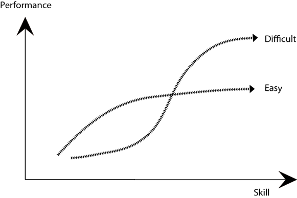

# Why Theory Matters

_Dag I.K. Sjøberg, Gunnar Bergersen and Tore Dybå_

## Introduction

<em>“Data without theory is blind, but theory without data is mere intellectual play.” 
      (Paraphrased from Kant)</em>

It is relatively easy to generate and acquire much data from SE activities. The challenge is to make meaning from the data. To increase our knowledge and insight, we should use and build more theories.

+	Theories help predict what will happen in the future.
+	Theories also explain why things happen, that is, causes and
     effects as opposed to only identifying
     correlations. [[possible link to the chapter “Correlation is not Causation” by Dybå et al.]]
+	Theories help reduce the complexity of the world
+	Theories summarize, condense and accumulate knowledge.

## How to use theory

What is the reason why a data set has become exactly what it is? For
example, we conducted an experiment on the effect of two different
control styles in Java programs. The “centralized control style” was
supposed to represent poor object-oriented programming. The
alternative, the “delegated control style”, was supposed to represent
good object-oriented programming. Among the 156 participants, we found
no difference between the control styles regarding the time spent on
solving the given tasks, given that the solutions were correct.

Does this imply that type of control style does not matter? No, when
digging into the data, we found that only the senior consultants
performed consistently better on the “good” solution. For the juniors,
the result was reversed; they consistently performed better on the
“poor” solution.

So, we found the opposite effect of the control style depending on the
category of developers. That one style benefitted juniors and another
one benefitted seniors, did that happen by coincidence in our
experiment or did we encounter a more general phenomenon described in
an existing theory? First, we searched through a literature review on
the use of theories in SE experiments conducted by Hannay et al. but
found no relevant theories. Then we searched in the scientific
psychology literature and found Sweller’s Cognitive Load Theory
(admittedly, after searching quite a long time). It states that the
cognitive load of novices in learning processes may require other
strategies than those that may benefit experts. One effect of the
Cognitive Load Theory is the “the expertise reversal effect”, a term
coined by Kalyuga et al. to denote the phenomenon that which
instructional technique is best may depend on the skills of the
learner.

If we replace “instructional technique” with “control style” and
consider senior consultants as experts and junior consultants as
novices, the expertise reversal effect may also be applied to our case
with control style.

## How to build theory

To make SE a more mature, scientific discipline, we need theories that
describe SE phenomena. Theory building may involve adapting an
existing theory or developing a theory from scratch. Either case is
certainly challenging, but one needs to be brave enough to start
theorizing and then accept critique for the initially proposed
theories. Through successive improvements made by the community, the
theories will become better and better.

Even though it has hardly been discussed in the SE literature, perhaps
the reversal effect that we found in the experiment above is a general
phenomenon in SE? To start theorizing on this issue, let us propose a
theory on the reversal effect of SE technology. We follow the
suggestion by Sjøberg et al. of describing a theory in terms of
constructs (the basic elements of the theory), propositions (the
interactions among the constructs), explanations (the reasons for the
claimed interactions) and scope (the circumstances under which the
theory is valid).

### Constructs:

+ _Software skill_ (the ability of a person to develop software) + _SE
  technology_ (method, technique, tool, language, etc. used to support
  software development)
+ _Performance_ (the quality gained and the time saved from using the
  technology)
+ _SE technology difficulty_ (how difficult it is to master the
  technology to exploit its potential; the more difficult the
  technology is, the better skills and/or more practice is needed to
  master it)
+ _Competing SE technologies_ (technologies that are supposed to
 support the same kind of SE activities)

### Propositions:

* P1: Given that one masters two competing SE technologies, using the
  most difficult SE technology gives highest development performance.
* P2: Given two competing SE technologies, T1 with little difficulty
  and T2 with great difficulty: T1 gives higher development
  performance than T2 for low-skilled developers; T2 gives higher
  development performance than T1 for high-skilled developers; see
  the following figure.

### Explanation:

P1 may be explained by the general case that a more sophisticated
technology may have many powerful features that lead to increased
performance but at the same may be difficult to use. For example, a
helicopter may transport more people and goods longer, faster and
across more diverse terrain than a bike, but a helicopter is also more
difficult to use.

P2 may be explained by the general case that if you have not mastered
the sophisticated technology, you will benefit more from using a less
sophisticated technology. When asked to solve an unfamiliar problem,
powerful features of the technology may require understanding of
certain abstractions. If one has no idea of what these abstractions
represent, solving the problem becomes even harder. In those cases,
one will benefit from stepping through the details that are available
rather than dealing with abstractions that one does not
understand. Think of a helicopter versus a bicycle if one does not
know how to operate either. The pedals have a clear connection with
the movement of the rear wheel. The operations of a helicopter are
much more abstract and thus more difficult to operate without
pre-established skills.

### Scope:

A theory should represent knowledge that is somewhat widely applicable
but still not trivial or one that follows from a definition. For
example, stating in a theory that “software development is a human
activity” provides no new knowledge. In disciplines that involve human
behaviour, one would hardly find such universal theories as Einstein’s
general theory of relativity in physics. Given the many context
factors that affect software development, it is a tough challenge to
define an appropriate scope for an SE theory. In the case of the
theory proposed here, we consider the scope to include only
technologies that are either in use in industry or are likely to be
useful on the basis of evidence from an artificial setting.

Kurt Lewin stated more than 60 years ago, “there is nothing so
practical as a good theory.” Particularly in an engineering discipline
like SE, theory should have practical applications. For example, the
theory proposed above could be used in cost-benefit considerations: If
an organization has low-skilled (high-skilled) developers, an easy
(difficult) SE technology should be used. Of course, there are many
trade-offs, but then one should consider whether it is sensible to let
the high-skilled developers construct a system if only the low-skilled
developers will perform maintenance in the future.

## In Summary: Find a Theory or Build one Yourself

So, the message here is that if you have obtained a set of data, you
should attempt to interpret it in the context of a theory. If you do
not find such a theory, use your data as a starting point for building
theory yourself.

However, paraphrasing Bunge, “premature theorizing is likely to be
wrong – but not sterile – and that a long deferred beginning of
theorizing is worse than any number of failures.” Concerning our
proposed theory, there may not always be a reversal effect; that is,
between two competing technologies, one of them may give better
performance for all skill levels. A more nuanced theory may classify
SE technologies into two more categories: easy to use technologies
that give increased performance for _all_ skill levels (mega success)
and more difficult to use technologies that give decreased performance
for all skill levels (many examples of such failures).

It is the task of the research community to collect or produce more
data that may strengthen, refine or refute a proposed theory. But one
has to start theorizing first.

## References

* E. Arisholm, E. and Sjøberg, D.I.K. Evaluating the Effect of a
         Delegated versus Centralized Control Style on the
         Maintainability of Object-Oriented Software, IEEE
         Transactions on Software Engineering, 30(8):521-534, 2004.
* Hannay, J.E., Sjøberg, D.I.K. and Dybå, T., A Systematic Review of
         Theory Use in Software Engineering Experiments, IEEE
         Transactions on Software Engineering, 33(2):87-107, 2007
* Kalyuga, S., Ayres, P., Chandler, P., and Sweller, J. (). The
         expertise reversal effect. Educational Psychologist,
         38:23-31, 2003.
* Lewin, K. The research center for group dynamics at Massachusetts
         Institute of Technology. Sociometry, 8:126-135, 1945.
* Sjøberg, D.I.K., Dybå, T., Anda, B.C.D. and Hannay,
         J.E. Erskine. Building Theories in Software
         Engineering, In Forrest Shull; Janice Singer & Dag
         Sjøberg (ed.), Advanced Topics in Empirical Software
         Engineering. Springer. 2008.
* Sweller, J., Cognitive load during problem solving: Effects on
         learning, Cognitive Science, 12:257-285, 1988.

