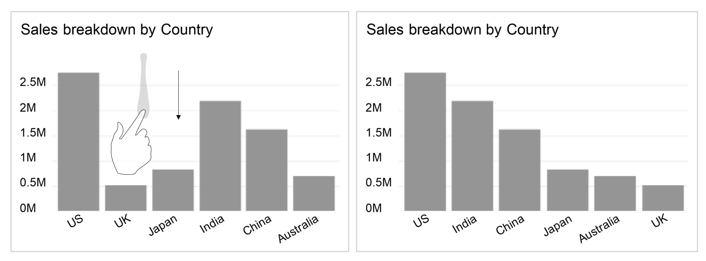

#Visual Analytics for Software Engineering Data
Zhitao Hou, Hongyu Zhang, Haidong Zhang, Dongmei Zhang

Microsoft Research, Beijing, China

Email: {zhith, honzhang, haizhang, dongmeiz}@microsoft.com
 

Many data analysis techniques have been widely used in practice to enable software practitioners to perform data exploration and analysis in order to obtain insightful and actionable knowledge for real tasks around software and services [1]. Although these techniques are effective, they require substantial knowledge and skills and are typically performed by "data scientists". Ordinary users (such as programmers, marketing personnel, service operators, managers, etc.) may find it difficult to apply these techniques to quickly explore the data and obtain insights by themselves. For example, users may have to learn SQL queries in order to extract data from a database, and to learn statistical techniques to analyze the data. Users often need to write programs to analyze data extracted from an Excel/text file. These techniques may increase the cost of data exploration for ordinary users and create high barrier to entry.

Many methods can be designed to democratize data analysis in software engineering. We advocate for incorporating visual analytics techniques into the analysis of software engineering data. Visual analytics is "the science of analytical reasoning facilitated by interactive visual interfaces" [2, 3]. It focuses on the interactive exploration and manipulation of the data. Using visual analytics techniques, a user can perform several successive queries and view the data in variety of formats before satisfactorily identifying the data in which they are most interested.

The Software Analytics group at Microsoft Research Asia developed a visual analytics tool called MetroEyes. MetroEyes can import data from external sources (such as Excel files or SQL database) automatically. Data is represented as visual objects such as a slice in a pie chart, a bar in a bar chart, or a series legend in a line chart, etc. MetroEyes provides an interactive graphical interface that enables users to directly click/touch/move all these objects. The visual objects can also be composed to form a new chart. MetroEyes is able to interpret the intentions of the visual operations, extract corresponding data from data source, and create a new chart. 

As an example, assuming that we have an Excel spreadsheet, which contains the App sales data of a multinational software corporation. The corporation has three product teams (code named TeamA, TeamB, and TeamC) developing Game and Education Apps. The data includes yearly App sales in different counties, along with the detailed sales of different teams and categories. There are five columns ("Year", "Team", "Category", "Country", "Sales") in the spreadsheet. Some sample records are shown in the table below. 

```
Year	Team	Category	 Country  Sales
2010	TeamA	Game	     US      0.5M
2010	TeamC	Game	     China   0.5M
2010	TeamA	Education	 US      0.1M
2011	TeamC	Education	 China   0.4M
2011	TeamB	Game	     US	     0.3M
2011	TeamB	Education	 China	  0.2M
```

In MetroEyes, users can perform data exploration through direct manipulation of the visual objects. Say the users want to explore the sales of TeamA. As illustrated in the figure below, users can directly select the TeamA bar from the bar chart representing contribution of each team to Sales, and drag and drop it into the canvas. The tool can then extract from the data source the App sales data contributed by TeamA, and display it in a new bar chart. This data operation selects a dimension value (Team = TeamA) and finds out its App sales, which is equivalent to the SQL query: SELECT Sales, Team FROM AppSales WHERE Team="TeamA". Note that each bar in the bar chart is a visual object, which can be touched and moved around. Furthermore, each bar represents the percentage of sales each team contributes (e.g., the TeamA bar indicates the percentage of the sales of the team A). The visual operations over the object have semantic meanings and correspond to certain data operations.
 ") 

As another example, say users want to explore the sales data by Team and Category. As illustrated in the figure below, users first select the Team dimension and drop it into the canvas. MetroEyes extracts the team data from the data source, and displays a chart that contains the App sales data broken down by Team. Users can then select the Category dimension and drop it to the chart. Finally, MetroEyes displays a chart that shows the Team’s sale data, broken down by category. This data operation explores data along multiple dimensions (in this case, the Team and Category dimensions), which is equivalent to the SQL query: SELECT Sales, Team, Category FROM AppSales. 
 ")

MetroEyes also enables changes from one data visualization format to another, and supports different types of data exploration tasks such as filtering and sorting. For example, data can be sorted through the use of gestures, as illustrated below.



When using MetroEyes to explore SE data, users do not need to write SQL queries or programs by themselves, or understand 
sophisticated mathematical concepts. What they need to do is to decide what data they want, and simply conduct direct manipulation over visual objects to obtain the data. Although the visual operations are very simple to perform, they are able to express rich semantics for data operations. Furthermore, users are able to view the graphical representation of the data throughout the entire exploration process, which provides a much more intuitive understanding of the underlying data. 


We believe that data analysis in Software Engineering should incorporate techniques from visual analytics, in order to help ordinary users analyze and understand their data. In this way, we lower the barrier to entry and reduce the cost of data exploration for ordinary users. MetroEyes has been used internally by Microsoft teams to perform various analytical tasks. We have successfully transferred the main concepts and experiences of MetroEyes to Microsoft Power BI product (http://www.powerbi.com), which was offically released in 2015.


##References

[1] D. Zhang, S. Han, Y. Dang, J. Lou, H. Zhang, and T. Xie. Software Analytics in Practice. IEEE Software, September/October 2013.

[2] J. Kielman and J. Thomas (Guest Eds.), "Special Issue: Foundations and Frontiers of Visual Analytics". In Information Visualization, Vol. 8, No. 4, 2009, pp. 239-314.

[3] J. Thomas and K. Cook, Illuminating the Path: Research and Development Agenda for Visual Analytics, IEEE-Press, 2005.

