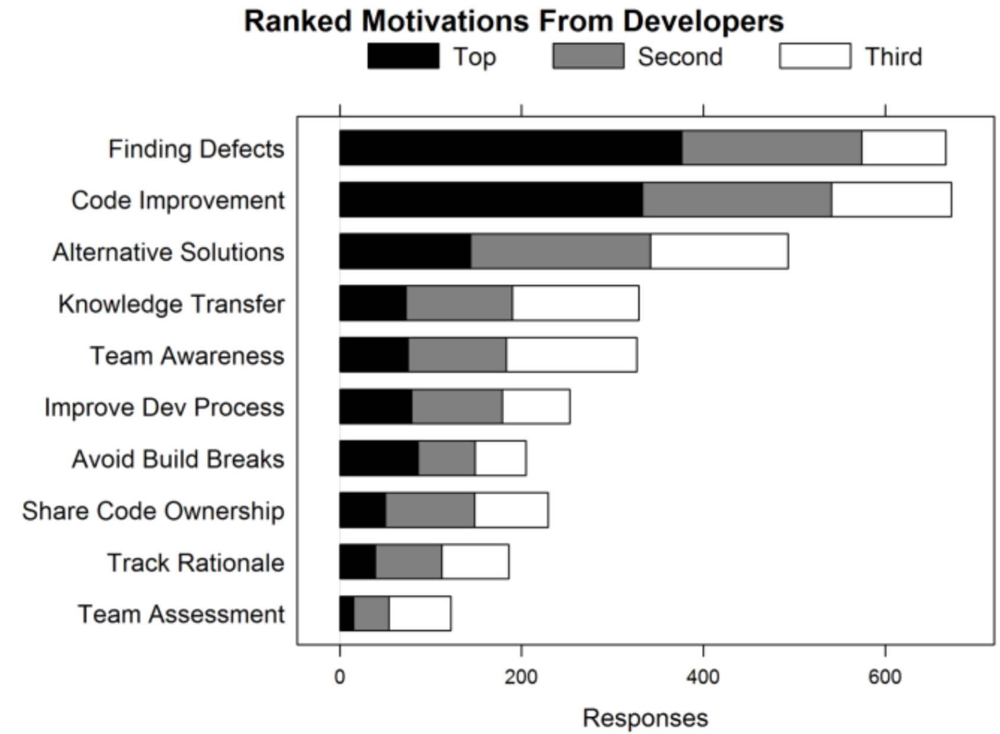

#Code reviews are not for finding defects - even established tools need occasional evaluation

The process of code reviewing in software engineering is analogous to a plan review in civil engineering or a paper review in academia. In all these, there is the assumption that the quality of output increases by applying differing viewpoints to the subject being reviewed and allowing the author to consider and apply the resulting feedback before finalizing the work.

But output quality is only one of several benefits. And indeed, as software engineers, we often claim the primary goal of code reviewing is to find defects. In fact, we also want reviewing to ensure our code’s long-term maintainability, we treat it as a knowledge sharing tool, and an avenue to broadcast ongoing progress [1]. On the surface, these are different purposes but the common thread is that code reviews allow a group of people to communicate over a shared view of an artefact undergoing a change.

Modern code reviewing traces back its roots to the process of inspection [2]. Inspections were originally conceived as formal meetings, to which participants would prepare ahead of time. Unlike inspections, code reviews do not require participants to be in the same place nor do they happen at a fixed, prearranged time. Aligning with a distributed nature of many software projects, code reviews are now asynchronous and frequently support geographically distributed reviewers. Code review tools are now built with these characteristics in mind and are well-integrated in the modern engineering workflows.

Because of their many uses and benefits, code reviews are a standard part of the modern software engineering workflow. But they come with non-trivial costs. Since they require heavy involvement of people, code reviewing is often the lengthiest part of code integration. On teams where code reviewing is a standard practice, the total time spent by each developer on code reviewing activities is on average between 2 and 6 hours per week [3,4].

Keeping in mind the significant costs of code reviewing, it is worth asking: Do we currently use code reviews in the most efficient way? In what situations, do code reviews provide more value than others? What is the value of consistency of applying code reviews equally to all code changes?

The confluence of many goals in one activity does not make it easy to understand where code reviews are most beneficial and how to best inject them into the overall engineering workflow so that the time spent waiting for the opinions of others is always justified. However, with the abundance of data coming from the engineering systems and having a diverse set of projects to observe [5], we finally have an opportunity to understand in detail the costs and benefits of the code review process.

##Results
Contrary to the often stated primary goal of code reviews, they often do not find functionality defects. Only about 15% of comments provided by reviewers indicate a possible defect. Defects that should block a code commit are likley even less frequent. Rather, it is feedback related to the long-term code maintainability that comprises a much larger portion of comments provided by reviewers; at least 50% of all.

The usefulness of code review comments—as judged by the author of a code change—is positively correlated with reviewers’ experience. Without prior exposure to the part of code base being reviewed, on average only 33% of any reviewer’s comments are deemed useful by the author of a change. However, reviewers typically learn very fast. When reviewing the same part of code base for the third time, the usefulness ratio increases to about 67% of their comments. By the fourth time, it is equivalent to the project’s long-term average. [6]

Code review usefulness is negatively correlated with the size of a code review. That is, the more files there are in a single review, the lower the overall rate of useful feedback. The decrease however only starts to be noticeable for reviews with 20 or more changed files. In addition, the absolute number of useful comments per review peaks for reviews of arround 50 files (6 useful comments) and then starts decreasing for larger reviews.  

Code reviews take deliberation and are performed by people with a specific set of skills. The social aspect of code reviews cannot be ignored: people's roles on the team and their standing in team's hierarchy influence the outcome. Often it is not only the author of the change but also the reviewers who find themselves under scrutiny.
 
##Effects

Modern code review process is expensive. Not only does it comprise a significant effort in terms of time spent but also it forces the reviewer to switch context away from their current work.

The median time from a review being requested to receiving all necessary sign-offs is about 24 hours, with many lasting days, sometimes weeks [7]. A long time in review causes process stalls and affects anyone who might be waiting to take a dependency on the new code. In addition, the longer the review time, the harder it is for the author to switch back to the change and incorporate the feedback of the reviewers without potentially introducing new defects.

The high cost of code reviews and reviewing having benefits that may not match the assumptions, often lead us to using them in our workflows in ways that are not efficient.

For example, requiring two sign-offs for all code changes without discrimination will make costs exceed the benefits of code reviewing in at least some of the cases. Moreover, since code reviews find commit blocking defects relatively infrequently, it might be prudent to change the practices to better fit that finding. One of Microsoft's large teams recently instituted a policy in which a developer is allowed to proceed with a commit after the very first code review sign-off. If there are more comments coming after that, another commit can be made to finalize the change.

##Conclusions

Code reviewing is an example of a software engineering process with established norms and expected outcomes. Its usage patterns and policies are often a result of combining the industry's collective learning and a specific team's culture. Past experiences of decision makers often dictate and reinforce policies. Even with such a well-established practice, it is useful to review its outcomes and verify if it applies to the specific context in which it is used, and if so, whether it still delivers the assumed results.

##References

[1] Alberto Bacchelli and Christian Bird. 2013. Expectations, outcomes, and challenges of modern code review. In Proceedings of the 2013 International Conference on Software Engineering (ICSE '13). IEEE Press, Piscataway, NJ, USA, 712-721.

[2] Lawrence G. Votta, Jr.. 1993. Does every inspection need a meeting?. SIGSOFT Softw. Eng. Notes 18, 5 (December 1993), 107-114.

[3] Internal Microsoft code review active usage study.

[4] Amiangshu Bosu and Jeffrey Carver. 2013. Impact of Peer Code Review on Peer Impression Formation: A Survey. Proceedings of the 7th ACM/IEEE International Symposium on Empirical Software Engineering and Measurement (ESEM), 2013. Baltimore, MD, USA, 133-142.

[5] Jacek Czerwonka, Nachiappan Nagappan, Wolfram Schulte, and Brendan Murphy. 2013. CODEMINE: Building a Software Development Data Analytics Platform at Microsoft. IEEE Software 30, 4 (July 2013), 64-71.

[6]	Peter C. Rigby and Christian Bird. 2013. Convergent contemporary software peer review practices. In Proceedings of the 2013 9th Joint Meeting on Foundations of Software Engineering (ESEC/FSE 2013). ACM, New York, NY, USA, 202-212.

[7] Amiangshu Bosu, Michaela Greiler, and Christian Bird, Characteristics of Useful Code Reviews: An Empirical Study at Microsoft. In Proceedings of the International Conference on Mining Software Repositories (MSR 2015).