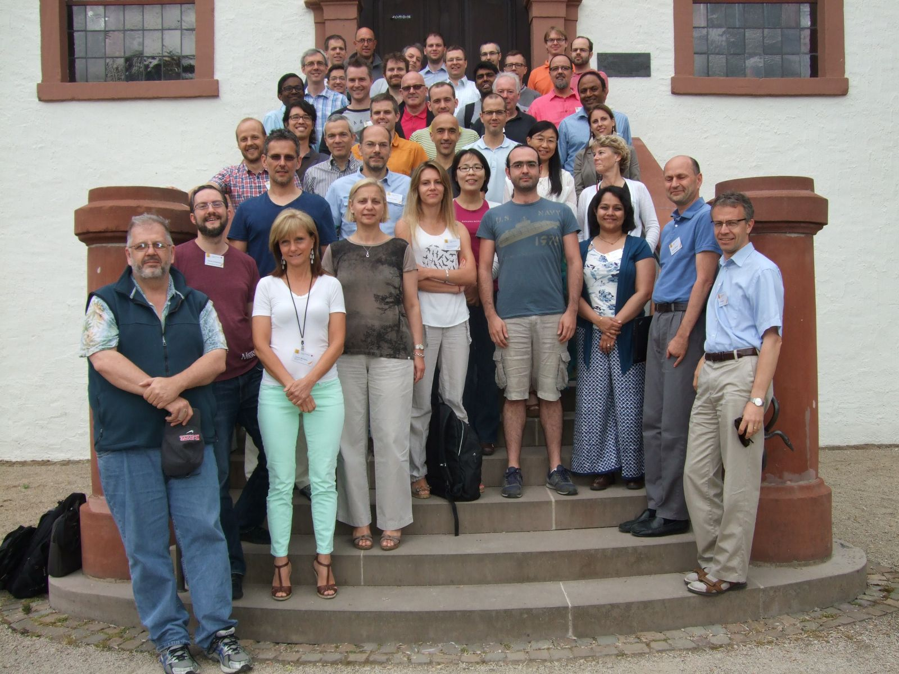

# Perspectives on Data Science for Software Engineering

<em>NOTE TO REVIWERS: This is draft0 of the book intro.</em>

- <em>Tim Menzies,   
Laurie Williams,  
Thomas Zimmermann</em>

## Why This Book?

Historically, this book began as a week-long workshop in Dagstuhl, Germany [1].
That workshop documented the range of work on software analytics, with the following premise:

+ _So little time, so much data._

The analysis of real world data is an exploding field, to
say this least, for various reasons:
- _Many useful methods:_ Decades of research in artificial intelligence, social science methods, visualizations, statistics, etc
has generated a large number of powerful  methods for learning from data.
- _Much support for those methods:_ Many of those
methods are explored in standard textbooks and
education programs.  Those methods are also
supported in toolkits that are widely available
(sometimes, even via free downloads). Further, given
the "big data" revolution, it is now simple and
inexpensive to acquire the hardware necessary, even
for the longest runs of these tools.

If general analytics is an active field, software analytics is doublely so.
Consider what we know about software projects:

- source code;
- emails about that code;
- check-ins;
- work items; 
- bug reports;
- test suites;
-  test executions;
-  and even some background information
of the developers. 

All this information is  recorded in software repositories such as
CVS, Subversion, GIT, GITHUB, and Bugzilla. Also found there are the telemetry data, run-time traces, and log files reflecting
how customers experience software (that information  includes application and feature usage and records of
performance and reliability).

This means that never before in the history have
we had so much information about the minute to minute actions
(and the effects of those actions) on people colloberating to 

- use someone else's products;
- generate and distribute new products;
- maintain and adapt existing products.

(Here, by "products" we mean everything from the four lines of SQL
that are triggered when someone surfs to a web page, to  scripts
that might be only dozens to hundreds of lines of code, or to much
larger open source and proprietary  systems. Also, our use of "products" includes
greenfield as well as on-going maintenence work, as well as combinations of hardware and software system).

Accordingly, for your consideration, this book
explore data science for software engineering to
offer insights into that process. The chapters here
were written by participants at the Dagstuhl
conference, plus numerous other experts in the field
on industrial and academic data mining.

## About this Book

Each chapter is aimed at a generalized audience with some technical interest in software
engineering. Hence, the chapters are very short and  to the point. Also, the authors of these chapters have taken care
to strip chapters of excessive and
confusing techno-speak.

As to insights themselves, they are in two categories:

- _SE-specfic lessons:_ Some offer valuable comments on issues that are
  specific to data science for software engineering
  (for example, see Geunther Ruhe's excellent
  chapter on decision support for software
  engineering).
- _General lessons about data analytucs:_ Others are more general. These
  comment on issues relating to drawing conclusions
  from real-world data. The case study material for these chapters come from the domain of software engineering problems.
  That said, this material has much to offer data scientists working in many other domains.
  
Our insights take many forms:

+ hints; 
+ tips;
+ tools;
+ tricks;
+ techniques;
+ traps for the unawary, as well as  the steps required to avoid those traps.

That said,  all our insights have one thing in common- _**we wished we known them years ago**_!!!!
If we had,  then that
would have
saved us ,  and our clients, so much time and money.

## The Future

While these chapters were written by experts, they
are hardly complete. Data science methods for SE are
continually changing so we view this book as a
"first edition" that will need significant and
regular updates. To that end, we have create a news
group for posting new insights. Feel free to make
any comment at all there. But if you want to be
considered for any future update of this book:

- Make the subject line some eye-catching "mantra";  i.e. some slogan reflecting best practice for data science for SE.
- The post  should be 
  - Short, and to the point.
  - Make little or no use of jargon, formula, diagrams, references.
  - Be approachable by a broad audience and have a clear take away message.

Share and enjoy!

## References

[1] Software Development Analytics (Dagstuhl Seminar 14261), Gall, Harald ; Menzies, Tim ; Williams, Laurie ; Zimmermann, Thomas 
Dagstuhl Reports Journal, 4(6) 64--83, 2014, http://drops.dagstuhl.de/opus/volltexte/2014/4763/

[2] F. Akiyama, “An Example of Software System Debugging,” Information Processing, vol. 71, 1971, pp. 353-359.

