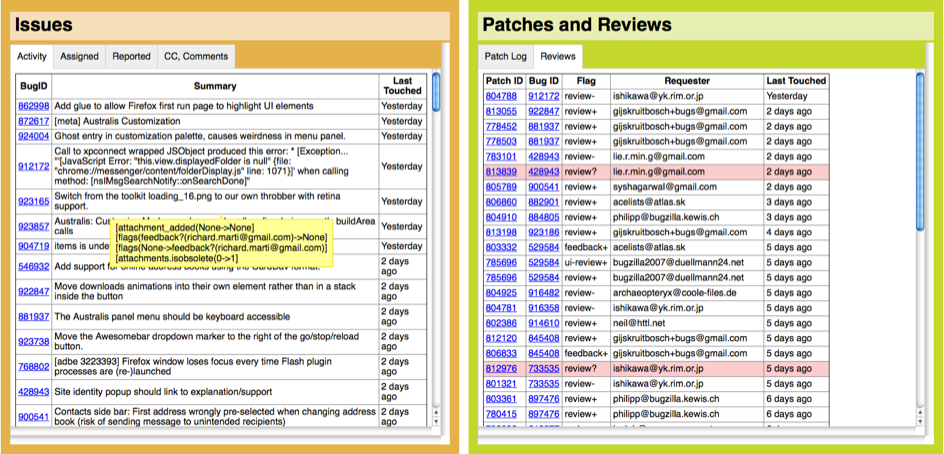

# A Tailored Suit: The Big Opportunity in Personalizing Issue Tracking
 _Olga Baysal, Carleton University, Canada_

## Many Choices, Nothing Great

Software developers use a variety of powerful tools and repositories in their daily work. Issue tracking is a key element of any software development project. Issue tracking systems (ITS) have long been used by software teams to report, discuss, and track both defects and new features. While issue trackers are good at providing a collaborative facility to developers, some routine tasks are poorly supported; a particular sore point is the weak support provided to developers in building and maintaining a detailed understanding of the current state of their system: What is the current status of the issues? Who is blocking me? How am I blocking others? How many bugs do I need to triage, fix, review, or follow up on?.

There are many issue-tracking systems available, both proprietary (e.g., JIRA, Google trackers) and open-source ones (e.g., Bugzilla, Trac). However, most issue-tracking systems face several limitations:

- complexity: they store an overwhelming amount of usually unused metadata fields (aka too many pockets in a too big suit) - the vast majority of which is irrelevant to the task at hand;

- performance: they can be unusably slow;

- usability: e.g., Bugzilla's user interface is unintuitive and wasn't designed to support process management;

- hard to query: developers are often unable to correctly formulate queries to access and correlate various pieces of metadata, this limitation is like having too short trousers that leave you in the cold no matter what;

- "one size fits all": provide generalized interfaces that can be used by not only developers but also managers, QA, marketing staff, graphic designers, and artists.

Because issue-tracking systems are complex, general-purpose tools that can provide an immense amount of raw information, developers may feel frustrated when they cannot easily access the particular set of details that they need for a given task. The information they seek is in there, somewhere, but not at their fingertips, and the tools often provide only limited support for their specialized, definable, and recurring information needs.

## The Need for Personalization

One way to help developers manage the complexity of issue trackers and the increasing volume of issues is to provide them with _personalized_ development tools that work to highlight the most important information for them, while eliminating the rest from view [1]. Our study [2] identified an industrial desire for this kind of personalization for issue tracking systems. The study captures developers' insights into the strengths, weaknesses, and possible future enhancements of the Bugzilla platform, the primary collaboration platform for Mozilla developers. 

Some limitations can be overcome by adding detailed information that is specific to developers and their tasks, and by providing the technical means for developers to create these personalized views themselves. That is, the personalization of issue-tracking systems can help developers better maintain situational awareness about both the issues they are working on and how they are blocking other developers' progress on their own issues [3]. _Situational awareness_ is a term from cognitive psychology that refers to a state of mind where a person is highly attuned to changes in their environment. In our context, situational awareness [3] describes how software developers must maintain awareness of what is happening on their project, to be able to manage a constant flow of information as issues evolve, and be able to plan appropriate actions. Developers often find themselves trying to identify the status of a bug — 1) What is the issue waiting on? 2) Who is working on what bug? 3) What are the workloads of others? 4) Who is the best person to review the patch?, as well as trying to track their own tasks — How many bugs do I need to triage, fix, review, or follow up on?. 

In our study, developers highlighted that customized views of the project's repositories that are tailored to their specific tasks could help them better track their progress and understand the surrounding technical context. 

## Developer Dashboards or "A Tailored Suit"

A personalized issue tracking can enable developers to better keep up with the evolution of their issues, and to more easily learn of new issues that may be relevant to them. The concept of personalization can be manifested in custom views of the issue-tracking system via _developer dashboards_ that are designed to overcome current limitations and provide developers with better awareness of their working environment. The figure below illustrates developer dashboards; it shows a custom view of the Bugzilla repository generated for a Mozilla developer. The dashboard serves as a template for displaying information to assist in developers' common tasks. This template contains all the key information elements [2] that are important to the developers - issues and patches. Developers work with both of these on a daily basis. Issues contain bug reports and new features that need to be implemented, while patches contain the reification of issues in source code that can then be reviewed by other developers. Both the management of issues and patches are of key concerns to developers.

Developer dashboards can enable developers to better focus on the evolution of their issues in a high-traffic environment, and to more easily learn about new issues that may be relevant to them.

  

While tailor-made suits can be personalized in any number of ways, customization can lead to overfitting, meaning the tool has to change if we change the process. Therefore, using dashboards is a great way to simply blend out the stuff that the team does not use or need, at least at the moment.

## Room for Improvement

1. Development of the next generation issue tracking that is _tailored to individual developers_ by equipping them with information _relevant_ to their current tasks.

2. _Real-time_ analytics are vital as they allow developers to see the "live" picture of what is happening with their issues.

3. Support for prioritization by means of enabling developers to set their own or team priorities on issues and tasks and sort them based on their importance. 

4. Development of _context-aware_ dashboards that are able to anticipate which information is important for a particular developer at a certain time. 

## References:

1. M.-A. Storey, L.-T. Cheng, I. Bull, and P. Rigby. Shared waypoints and social tagging to support collaboration in software development. In Proc. of the 20th Anniversary Conference on Computer Supported Cooperative Work (CSCW), 2006. pp. 195–198

2. O. Baysal, R. Holmes, and M. W. Godfrey. No Issue Left Behind: Reducing Information Overload in Issue Tracking. In Proc. of the International Symposium on the Foundations of Software Engineering (FSE), 2014. pp. 666–677

3. O. Baysal, R. Holmes, and M. W. Godfrey. Situational Awareness: Personalizing Issue Management Systems. In Proc. of the New Ideas and Emerging Results (NIER) Track, the 35th International Conference on Software Engineering, 2013. pp. 1185–1188
