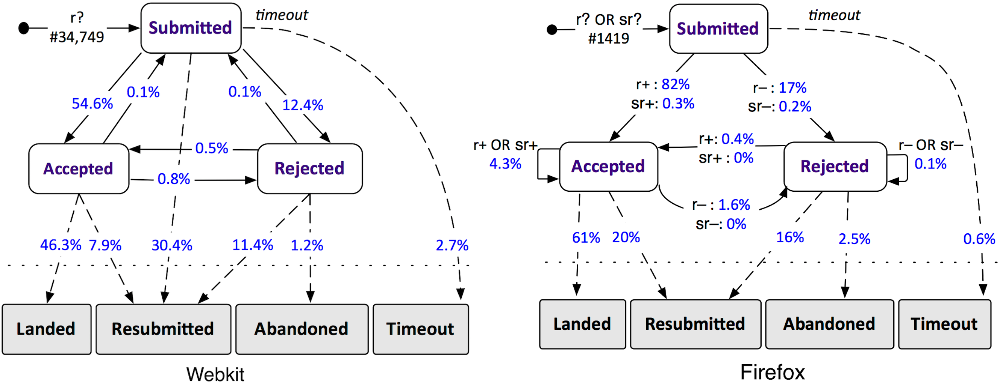

# Summarizing Dynamic Data
Reid Holmes, University of British Columbia, Canada

## Bikeshedding in Software Engineering

A group of scientists sit down on a nice sunny day to examine a large tabular data set they have experimentally gathered. The first order of business is to figure out what program they should use for analysis; should they use Excel? OpenOffice? R? An online collaborative spreadsheet? Resolving the matter to everyone's satisfaction takes an hour. Next they tackle the column names: Should they be all caps? Can they contain spaces? Should they be short, or should they be descriptive? Agreeing to a naming scheme takes another three hours. 

Throughout this time, the data is just sitting there. Row upon row. Waiting to give insight. But the volume is overwhelming; it is more comfortable to tackle issues that are easy to reason about and have less technical baggage. This phenomenon is known as 'bikeshedding', or Parkinson's law of triviality. Rather than exploring the data itself, the meeting gets derailed by administrative minutiae. This phenomena is also related to 'analysis paralysis', whereby transitioning from _talking_ about something to actually _doing_ it is overwhelming and inhibits progress.

## Summarizing temporal data

As in the bikeshedding example above, it is easy to be overwhelmed with the complexity of large datasets. Faced with a daunting data set (once of course it is appropriately formatted and named), we often want to build some form of summarization. Given the form of the data it is often tempting to count events or to build distributions because these are easy to think about; however, in data sets that are temporal in nature it is possible to to find interesting relationships between data points by noting how they are related through time. 

To do this, first identify the 'states' that are possible (for instance for a test execution you could have a pass, error, or fail; for a code review you could have the review request, a positive review, or a negative review). Next, iterate through the data and figure out at each point in time what state is appropriate in each instance in time. Finally, draw a state-transition diagram where each node is a state and edges represent transitions between the states. Annotate each edge with a count representing the number of times it occurred in the data. Two important things are often visible in these diagrams; first: the most dominant transitions are instantly visible and can help to guide future investigation; second: unexpected edges are often present.

While any expected edge confirms your understanding of the data, unexpected edges provide insight into how your model of the data could be incorrect. These unexpected transitions are therefore a great place to start a qualitative investigation of the individual data points they represent and provide a concrete way to move from a summarization to a in depth examination of specific rows in your data.

A concrete example is shown in the figure below. In this work we compared code review practices between Webkit and Firefox. By examining the summarization of the tens of thousands of data points provided by the state-transition diagram, we can see some huge differences between the two projects. The most notable of these is the edge between submitted and resubmitted for Webkit; while a first we thought this was an error in our data, it gave us a concrete question to approach the Webkit developers about and greatly contributed to our understanding of the Webkit code review process.

  

## Recommendations

1) Data can be overwhelming; while tabular summarization is often tempting, this can abstract away important relationships between data points.

2) The flows between implicit states in the data are often hard to identify and can provide tremendous insight into what the data represents.

3) Starting a qualitative investigation from events captured by unexpected transitions often highlights conceptual misunderstandings which can be used to refine and improve the initial model or suggest future research ideas.

## References

[1] Olga Baysal, Oleksii Kononenko, Reid Holmes, and Michael W. Godfrey. Investigating Technical and Non-Technical Factors Influencing Modern Code Review. Journal of Empirical Software Engineering (ESE). 2015. 1-28. [http://dx.doi.org/10.1007/s10664-015-9366-8]
