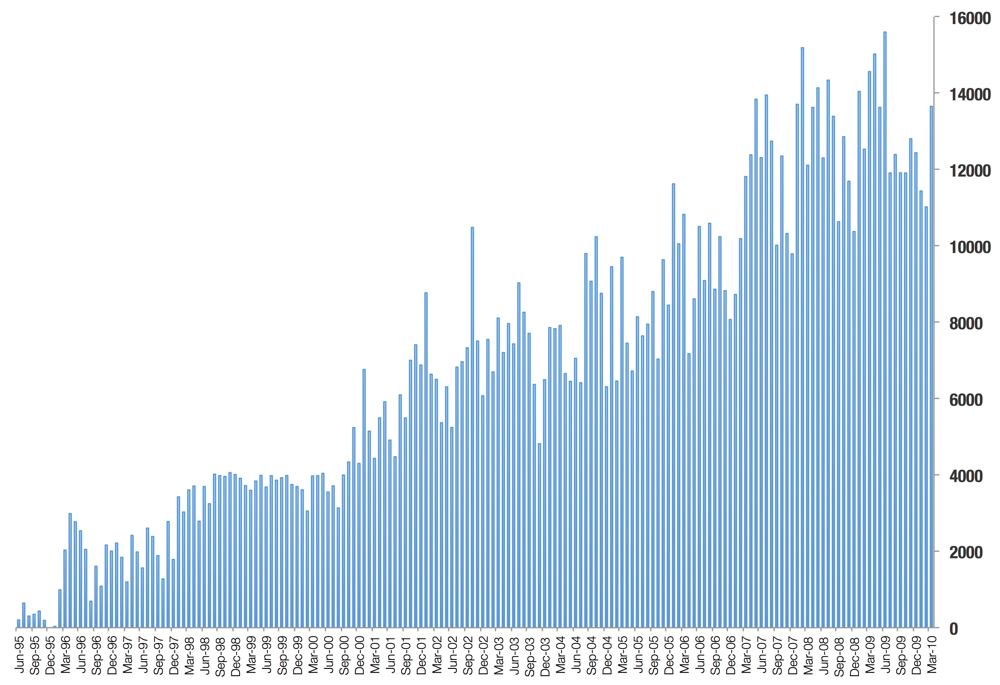
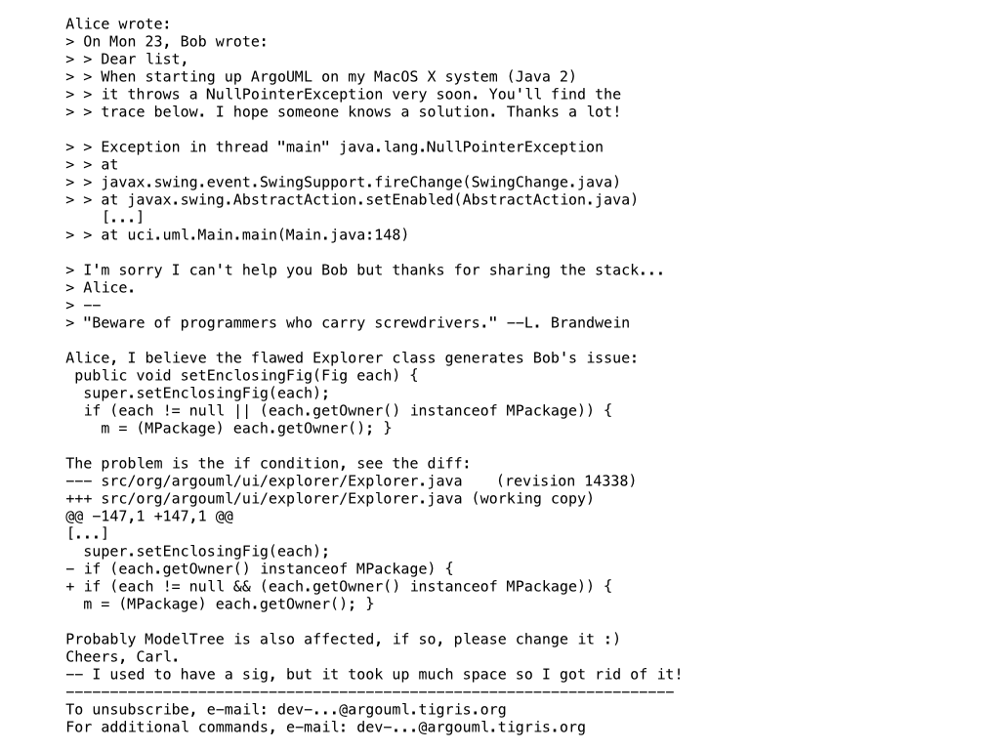
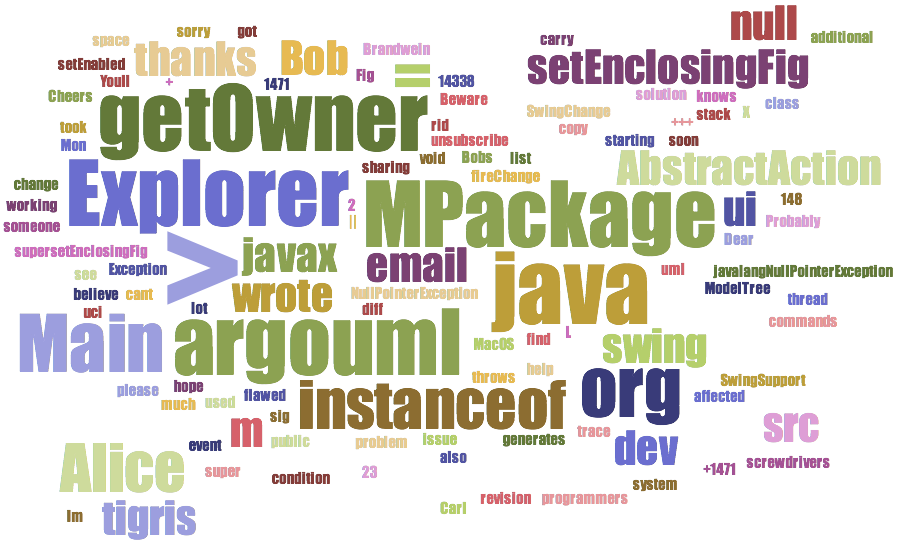
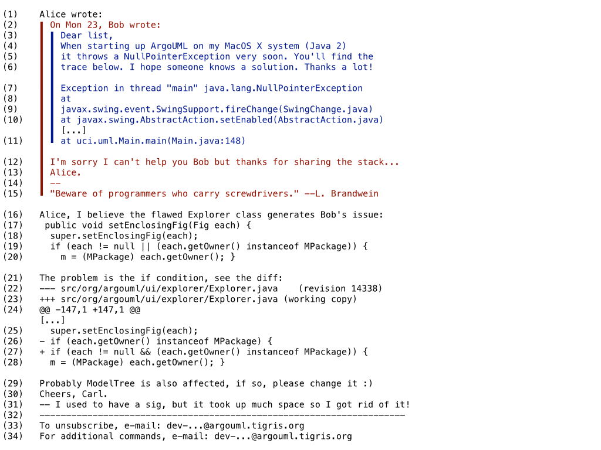
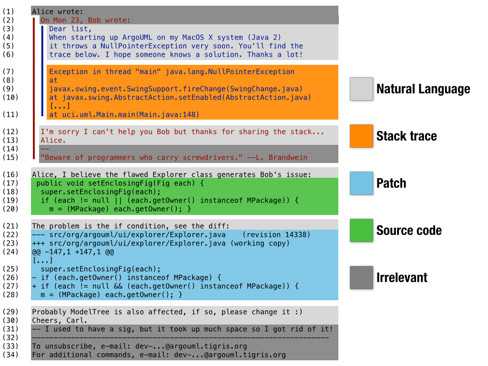
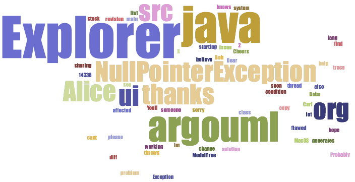

# Summarizing Unstructured Data
Alberto Bacchelli, Delft University of Technology, The Netherlands

## Unstructured data in Software Engineering
One person that never took part in a serious team development effort may easily
think that what software engineers do all day is to stay behind a screen and
read and write only one thing: Source code.

Maybe that is the *dream* of every software engineer, but definitely not the
reality.  Software engineers spend lots and lots of time writing all sorts of
material that is unquestionably *not source code*. Even in open-source software
projects, where there is not really a manager-mandated development process, we
clearly see this happening.

Look for example at the figure below. It represents the volume of emails
exchanged *monthly* in the Linux kernel mailing list, from June 1995 to March
2010. With a constantly growing trend, we see that in the last month we
consider, developers exchanged 13,657 emails, or 440 emails *per day*.

  

And emails are just one of the type of documents that software engineer produce
and read daily. They also write and read issue reports, design documents,
commit messages, code review messages, ... All these form the so-called
*unstructured software data*, i.e., data written in natural language by people
for other people (as opposed to source code, which is written for a computer,
or log messages, which are generated by a computer for a human).

## Summarizing unstructured software data

With that much information available, it is doubtful that engineers have the
chance to read all the documents and get the right information out of them. For
this reason, researchers in software engineer looked into various techniques to
summarize, or aggregate the various information available in unstructured
software data.

### As simple as possible.. but not simpler!

The first reasonable approach for unstructured software data summarization is
to tap into the methods devised by the community of Information Retrieval,
whose target is exactly to retrieve information from natural language
documents, and to combine them with some basic visualization techniques.

So, let us say we want to summarize the email information produced in just a
single discussion thread on the mailing list of an open-source software
project. A common solution would be to collect all the terms present in those
emails and display them a tag cloud [1] where the most occurring terms are
represented in larger fonts and the less occurring ones are represented in
smaller fonts. The more visible a term is in the tag cloud, the greater should
be its semantic value. Terms are defined as single words, divided by space or
punctuation, or some special characters.

Let us take the content of the following email, adapted from a real email sent
to the mailing list of an open source system (ArgoUML):

  

If we had to summarize the content, we could say that there are three people
involved and the content refers to a bug affecting OS X, which is solved by
patching the class "Explorer". How good would a tag cloud represent this
threaded email? If we create a tag cloud directly from it, we obtain the
following:

  

The tag cloud already gives us some interesting information, but it also
contains a lot of noise, which reduces the visibility of what really matters.
Apparently, taking "off the shelf" methods from information retrieval and
data visualization is quick and simple, but it is probably a "too simple"
solution, not good enough to solve our problem.

### You need structure!

Why did the method above not work well? Because most off-the-shelf techniques
are prepared to work on a very specific kind of data. If we took newspaper
articles and followed the same approach, we would probably have obtained more
interesting results. But documents generated by software engineers are
substantially different from those generated by writing professionals, such as
newspaper journalists.  Developers might use jargon more often and have a more
terse language, and there is a lot of implicit knowledge not expressed. Then,
emails contain text that is not relevant for analyzing their content, such as
authors' signatures.  Finally, and perhaps most important, software engineer
often mix languages: Natural language is mixed with source code, stack traces,
patches.

If we really want to extract useful information, which can be summarized, from
unstructured software data, we first have to find the latent structure it has
and exploit it correctly.

How can we give structure to a wall of text, such as an email? We first can
realize that there is a simple underlying structure we can and should take
advantage of, and build on top of it. We should take into account that threaded
emails already give us information about how many people are involved in the
discussion (the starting '>'s tell us about the indentation level). Then we can
exploit a structure that is already there: Emails are divided by authors in
lines; our previous research showed that this is a very good starting point in
finding the structure of a message [2]. Considering these two aspects, we
obtain the following version of the same email, which visually already gives us
much more information (this is what every good email client would do):

  

Once we have this basic structure, the next step is realizing that, in most of
the cases, the different languages used in emails are used in different lines.
In this way, we simplified our problem into a *classification* problem: How can
we assign each line to the language it belongs to? From our email, we would
like to have a categorization that looks like the following:

  

Is it possible to automatically tag each line with the language it is written
in? Yes! Researchers developed a number of methods to classify text in
different categories. A classical example is the case of classifying a whole
email into "spam" or legitimate. In the case of development emails, we
developed simple methods to recognize lines of code from other text [2] and
more complex ones to recognize more complex languages, such as those used in
signatures, from natural language content [3]. As an example, here we describe
how the lines of Java source code can be recognized in the content of an email,
with a very simple, yet effective approach, and see what is its impact on a
final tag cloud summary.

If we consider lines 17--20 and 25--28, we note a peculiarity present in many
programming languages (e.g., Java, C, C#, Perl): The developer must end each
statement with a semicolon or a curly bracket (mainly used to open or close a
block). Based on this intuition, a simple approach that verifies whether the
last character of a line is a semicolon or a curly bracket might be a good way
to detect source code. Plus, we can write a simple regular expression to
recognize the lines of a stack trace (9--11) as they have a very clear
structure, without any nested block.

We tested this approach on thousands of emails from 5 Java source systems and
we found that it is working well in practice and can be used as a basis for
further data analysis on emails [2].

Now, if we take our initial email, we remove the signatures (by for example,
eliminating everything at the end after the dashes) and apply the source code
detection approach, we can generate a new tag cloud, as the one depicted below.
Now we see that more important terms (such as 'Explorer' and
'NullPointerException') started to emerge, thus creating a summary that gives a
much better idea of the content.

  

With more sophisticated approaches [3], we can even *parse* the different parts
of the content of a development email and remove more noise, thus making emerge
the most important content and creating better summaries.

### Conclusion

In this brief chapter, we made everybody aware that developers do not only
write source code, but many other artifacts, such as issue reports, design
documents, emails, etc.

We showed that the amount of these artifacts can be overwhelming (as in the
case of development emails for the linux mailing list), so we need some way to
summarize the information they contain for a faster, yet still useful
consumption. We made the case that, unfortunately, the best candidate
techniques from information retrieval do not work well in the case of software
engineering documents, because unstructured software data has a very special
language. In particular, software engineers often mix up many languages in the
same document: Natural language, source code, stack traces, etc.

For this, we presented the steps that one can take to transform the very
unstructured content of an email, into something that can be analyzed to
generate a valid summary. These steps involve the recognition of the latent
structure of documents and the languages in which they are composed.
Surprisingly, a simple approach is able to detect reasonably most of these
languages and to remove them from text if necessary.

As a result, we were able to obtain a much more informative tag cloud that
summarizes the content of a threaded email, thus giving ideas on how an
approach can be developed to analyze and summarize similar unstructured
software documents.

[1] Tag cloud. (2015, September 1). In Wikipedia, The Free Encyclopedia.
Retrieved from
https://en.wikipedia.org/w/index.php?title=Tag_cloud&oldid=678980330

[2] Alberto Bacchelli, Marco D'Ambros, Michele Lanza:
Extracting Source Code from E-Mails. ICPC 2010: 24-33

[3] Alberto Bacchelli, Tommaso Dal Sasso, Marco D'Ambros, Michele Lanza:
Content classification of development emails. ICSE 2012: 375-385

