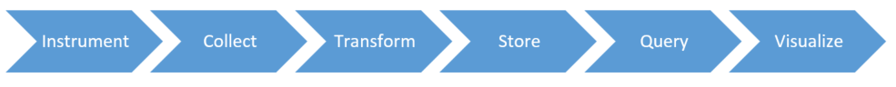

# Reducing Time to Insight

## What is Insight Anyway?

Insight Production, preferably with data (I jest), is a big part of my role at Microsoft.  And if you're reading this chapter, I'll assert you are also an Insight Producer, or well on your way to becoming one.

Since insight is the product, let's start with a simple definition.  The classical definition of insight is new understanding or human comprehension.  That works well for the result of a science experiment and answering a research question.  Industry, with its primordial goal of growing results, focuses my definition to new _actionable_ comprehension for _improved results_. This constrains the questions of ~~research~~ insight search to subjects and behaviors known to contribute business value.

Let's look at a more concrete example.  As a purveyor and student of software engineering insights, I know large software organizations value code velocity, sometimes called speed or productivity and quality as a control. Organizations also value engineer satisfaction if you're lucky.  So I seek to understand existing behaviors and their contribution to those areas.  I am continuously hunting for new or different behaviors that can dramatically improve those results.

## Time to Insight

_"There is immeasurable distance between late and too late."_

-- Og Mandino (American Essayist and Phsycologist)

An insight's value can decay rapidly, and eventually expire all together as un-actionable. History is full of war stories where intelligence arrived in time to change the outcome.  Stock markets quickly sway and even crash based on insights.  But an alert that my service is down, an hour after receiving a phone call from my best customer's lawyer to handle damages from the outage is both too late, and un-insightful! The key point here is that speeding up data processing and information production creates new opportunities for insight that was previously blocked, by giving time to take action on the new understanding. This also adds a competitive edge, in almost any human endeavor.

Let's start with a simple definition of Time to Insight (TTI): _Elapsed calendar time between a question being asked, and the answer understood, well enough for action to be taken._

This seems pretty straight forward until you start peeling it apart.  There are a couple big variables left:

1. **Who is the customer?** Who can ask the questions? For someone in Insight Production, this is often the one cutting the checks, and those responsible for making decisions and taking action. This matters immensely because they will need to be able to interface with you effectively to ask the questions, and comprehend the answers into insights to take appropriate action. If they don't know how to read a dendrogram, I recommend teaching them or giving them an alternative visualization.
2. **Which questions will deliver the most lifetime value?** With constrained resources to invest, it's worth prioritizing investment. A simple proxy I frequently use for this is how many times the question will be asked. Generally if you optimize for questions that have some value and are asked the most often, the results are good. It is more difficult to optimize for the highest value questions which often only need to be answered once.

A great TTI experience to showcase is searching the internet with Google or Bing. The whole world's population has been trained to ask their public domain questions into the little search box using keywords and semi-natural language.  And they all expect a fast, sub-second response!  They may not get exactly the answer or insight they were looking for on their first try.  But the cost of more attempts is so low that curiosity overcomes the friction and the result is an interactive Question and Answer session that often ends with some new or new again knowledge (how many of you also forget the name of the actor in that movie and look it up on your phone?).  If only my search engine was omniscient and I could ask it anything!  What is also great about the search model is the feedback loop of what questions users are asking.  Volumes and trends of what questions the world is asking turns out to be very valuable.

Time to Insight is getting traction from the likes of Forbes[1][2], as the leading Key Performance Indicator (KPI) for insight production and analytics teams.  And I agree!  In fact, I devote at least 50% of the insight production team I run at Microsoft to reducing the Time to Insight.  These engineers are experts at instrumenting, collecting, modelling, curating, indexing, and storing data for fast query into formats, schemas, indexes and query engines that are the most familiar and accessible to those asking the questions.  They can include a mixture of natural language and full-text search, CSV, Excel, SQL, OLAP cubes, and even visualizations in dashboards and scorecards.  The goal is to deliver the customer's desired insight very quickly in the most effective medium.

## The Insight Value Chain

For industry and academia alike, the capability to produce insights fast is often a differentiated, competitive advantage.  One pro tip is to think of Insight Production as a value chain[3][4].  Identify and evaluate the primary activities between a question asked, and an insightful response given.  These often include, but are not limited to: collect data, analyze, transform, store, query, visualize, and sometimes it even requires a person to help interpret the data for the customer for them to have the ideal actionable insight.

Where is the time spent? Is data collection still manual?  Perhaps there are expensive computations and transformation that add hours of lag.  Evaluate each activity and identify the best systemic ways to reduce TTI. In other words, perform a Value Chain Analysis[5].

## What To Do

Here are a few tips from the trenches of insight production. This first set of tips help you start with the end, or moment of insight, in mind. This is often a specific visualization, report or scorecard with KPIs. It could also be a few fast ad-hoc queries to a well modelled store to discover and validate the next big insight. But the result is valuable new understanding that is delivered in time to take that next positive action.

- Visualization matters! How long do people need to stare at the screen to have the "eureka" moment? A good example from industry is the simple Key Performance Indicator, or KPI. There is little to no cognitive friction in a well-designed KPI. It's red or green and a simple number. Learning to read candlestick charts take a bit longer but can still be the simplest way to communication more complicated distributions and relationships.
- Assist human comprehension with the simplest models and easy access to experts and docs. The simplest model to explain typically yields the fastest comprehension. Simple statistical models can be preferred over neural networks for this reason.  And an insight may well require a subject matter expert to interpret and explain it, in addition to the visualization.
- The last mile on _fast_ insights. Sometimes it is critical to get humans reacting to new information immediately. Consider firemen at the fire station responding to a call and alarms blaring and lights flashing. Sometimes a web page isn't going to hack it and you need to push the insight via information radiators, pagers, text messages, or even alarm bells to ensure the information is received with enough time to react.

Here are a few more technnical tips.

- Automate everything! Data collection, cleansing, and curation. This can even include saving or caching intermediary results that can be take too long to re-compute. No manual step or computation is too small to automate when you need to scale.
- Use the right data store or index. Know when to use in-memory caches, relational stores, multi-dimensional stores, text search stores, graph stores, stream processing, or even map reduce systems. Each is best for certain types of questions at different scales. At smaller scales, you might get away with one store. At cloud scales, you start specializing to get the incremental load and query latencies down to what you need for certain classes of questions. Fight hype that one new store will rule them all.
- Push compute and quality upstream. Connect people who understand the insight desired with the people instrumenting the process. Well-designed instrumentation and collection coupled with standard or thoughtful data formats and schemas often yield data more fit for insights and require less transforms, joins, cleansing, and sampling throughout the pipeline. That produces speed and lower costs! Also, fewer distinct collection systems tend to reduce the join complications later by coalescing data formats, schemas and stores earlier.
- Shoot to deliver self-service[6][7]. Self-service means the person with the questions has access to all layers of data (raw to curated) and unfettered access to the instrumentation and transformation code. This build transparency and trust in the insight, but it can also help the smart humans that can help themselves. Of course do this within the safety of your data policies.

## A Warning on Waste

Simply put, large data platform and analytical systems are usually expensive, in many dimensions: calendar, hardware, software, and data experts to build and run it.  I have witnessed numerous projects invest too much, too early, to answer an interesting question exactly once. The advice I give is to always answer the first few questions, usually generated by a GQM[8] exercise manually, as cheap as possible.  And then let usage, or the questions that keep getting asked repeatedly guide and justify funding investments to automate and lower TTI on the questions your audience actually has _and_ will act on.

## References

[1] Bruce Upbin. 2012. [What's Your Time To Insight?](http://www.forbes.com/sites/ciocentral/2012/08/10/whats-your-time-to-insight/) Blog Article on Forbes.com.

[2] Cindi Howson. 2012. [Visual Data Discovery: More than a Pretty Face?](http://insideanalysis.com/2012/08/visual-data-discovery/) Blog Article on InsideAnalysis.com.

[3] Various. [Value Chain](https://en.wikipedia.org/wiki/Value_chain). Wikipedia.

[4] Michael E. Porter. 1985. [Competitive Advantage: Creating and Sustaining Superior Performance](http://books.google.ca/books?hl=en&lr=&id=H9ReAijCK8cC&oi=fnd&pg=PR15&dq=competitive+Advantage:+Creating+and+Sustaining+Superior+Performance&ots=p78IUD5U3M&sig=EAV1QwH8f2wE82j8gTsobcfBjDM#v=onepage&q=competitive%20Advantage%3A%20Creating%20and%20Sustaining%20Superior%20Performance&f=false). New York: Simon and Schuster. Retrieved 2013.

[5] Ovidijus Jurevicius. 2013. [Value Chain Analysis](http://www.strategicmanagementinsight.com/tools/value-chain-analysis.html). Blog Article on StrategicManagementInsight.com

[6] Drew Rockwell. 2015. [Speeding Time to Insight: Why Self-Service Data Prep is the Future of Big Data](http://www.lavastorm.com/blog/post/speeding-time-to-insight-why-self-service-data-prep-is-the-future-of-big-data/). Blog Article on LavaStorm.com

[7] Rob van der Meulen, Janessa Rivera. 2015. [Gartner Says Power Shift in Business Intelligence and Analytics Will Fuel Disruption](http://www.gartner.com/newsroom/id/2970917). Press Release on Gartner.com

[8] Victor R. Basili. 1992. Software Modeling and Measurement: The Goal/Question/Metric Paradigm. Technical Report. University of Maryland at College Park, College Park, MD, USA.
